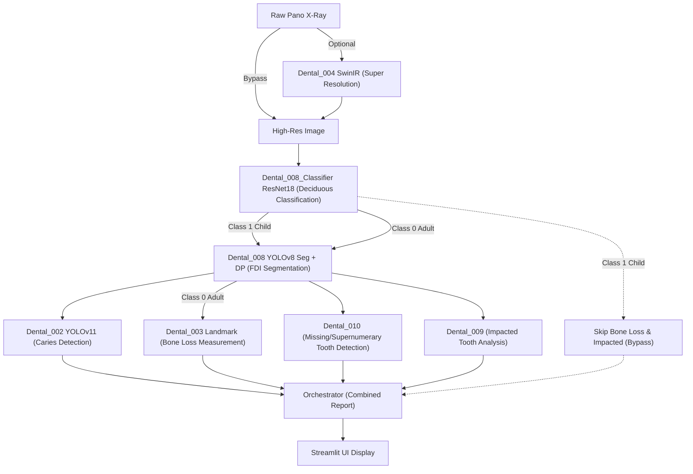

    

# Dental Panoramic Reader

파노라마 방사선 사진(Panoramic Radiograph)을 입력받아 화질 개선부터 치아 식별, 병소 탐지, 결손치 파악, 매복치 분석, 치조골 소실량 측정까지 아우르는 **End-to-End 통합 진단 애플리케이션**입니다.
서로 다른 역할을 수행하는 인공지능 모듈(002, 003, 004, 008, 009, 010)을 서브모듈로 구성하고, 이를 하나의 일관된 진단 리포트로 통합(Orchestration)합니다.

## 핵심 파이프라인 (Architecture & Data Flow)

파이프라인은 데이터베이스나 외부 API 통신 없이 Python 런타임 내장 참조(In-memory Submodule Call)를 통해 최적화된 속도로 동작합니다.



### 각 모듈별 상세 역할
1. **Dental_004 (화질 개선)**: 해상도가 낮거나 노이즈가 많은 입력 원본 이미지를 SwinIR 모델을 통해 스케일업(Super Resolution) 및 노이즈 제거 처리합니다.
2. **Dental_008 (치아 식별 및 영역 분할)**: YOLOv8 Instance Segmentation 모델로 치아를 검출하고, 기하학적 간격 기반 DP 알고리즘을 통해 결손치 상황에서도 치식 번호(FDI)를 정확히 부여합니다. 파이프라인의 **Backbone** 역할을 수행합니다.
3. **Dental_010 (결손/과잉치 판별)**: 008이 제공한 FDI 리스트를 기반으로 순수 집합(Set) 연산을 수행, 한국인 특화 발치 케이스(사랑니, 소구치 등)에 대한 결손치를 정확히 도출합니다.
4. **Dental_009 (매복치 정밀 분석)**: 008이 제공한 제3대구치 마스크 좌표를 주성분 분석(PCA)하여, 제2대구치와의 장축 각도 차이 기반 Winter's Class 및 맹출 상태(Eruption Status)를 계산합니다.
5. **Dental_002 (병소 탐지)**: YOLOv11 기반 객체 탐지 모델을 통해 충치(Caries) 등의 병리학적 의심 영역을 찾아냅니다. 치아 번호는 008 결과와 정합합니다.
6. **Dental_003 (치조골 소실 측정)**: SAM 및 랜드마크 알고리즘을 사용해 CEJ, Crest, Apex 좌표를 찍고 RBL(%)을 계산합니다.

## 설치 및 실행 방법

### 1. 소스코드 다운로드
Git Submodule을 포함하여 모든 모듈 코드를 다운로드합니다.
```bash
git clone --recursive https://github.com/HyunchanAn/Dental_Panoramic_Reader.git
cd Dental_Panoramic_Reader
```

### 2. 패키지 설치
각 서브모듈이 요구하는 라이브러리를 통합하여 설치합니다.
```bash
pip install -r requirements.txt
```

### 3. 애플리케이션 실행
```bash
streamlit run app.py
```

## 시스템 요구사항
- **GPU**: NVIDIA RTX 4060 Laptop (8GB VRAM) 수준에 맞추어 `core/model_manager.py`가 구동 시나리오별 GPU 메모리 스왑 및 캐시 클리어링(PyTorch VRAM 최적화)을 자동 수행합니다.
- **OS**: Windows / Linux 지원

## 라이선스
MIT License


## 개요
이 레포지토리는 치과 AI 모듈러 시스템의 일부입니다.
