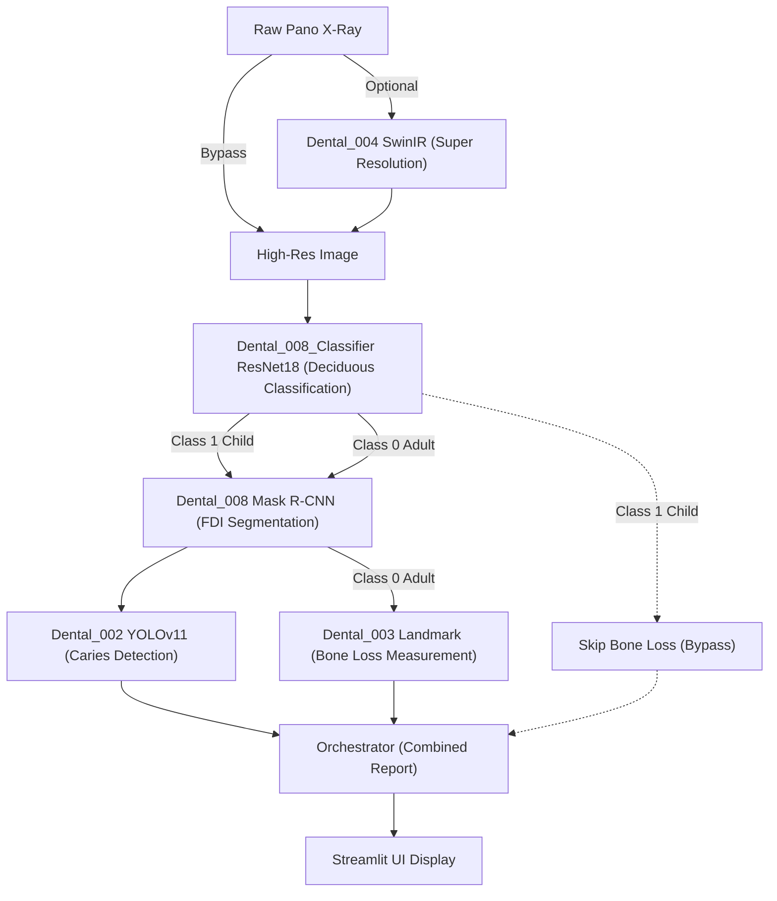

    

# Dental Panoramic Reader

파노라마 방사선 사진(Panoramic Radiograph)을 입력받아 화질 개선부터 치아 식별, 병소 탐지, 치조골 소실량 측정까지 아우르는 **End-to-End 통합 진단 애플리케이션**입니다.
서로 다른 역할을 수행하는 4개의 인공지능 모듈(002, 003, 004, 008)을 서브모듈로 구성하고, 이를 하나의 일관된 진단 리포트로 통합(Orchestration)합니다.

## 핵심 파이프라인 (Architecture & Data Flow)

파이프라인은 데이터베이스나 외부 API 통신 없이 Python 런타임 내장 참조(In-memory Submodule Call)를 통해 최적화된 속도로 동작합니다.



### 각 모듈별 상세 역할
1. **Dental_004 (화질 개선)**: 해상도가 낮거나 노이즈가 많은 입력 원본 이미지를 SwinIR 모델을 통해 스케일업(Super Resolution) 및 노이즈 제거 처리합니다. 이후의 모든 분석은 이 고해상도 이미지를 기반으로 수행되어 정확도를 극대화합니다.
2. **Dental_008 (치아 식별 및 영역 분할)**: Mask R-CNN을 활용하여 파노라마 내의 각 치아(영구치/유치) 객체를 픽셀 단위로 분할(Segmentation)하고, 각 치아에 정확한 FDI 번호를 부여합니다. 
3. **Dental_002 (병소 탐지)**: YOLOv11 기반 객체 탐지 모델을 통해 충치(Caries), 매복치(Impacted) 등의 병리학적 의심 영역(Bounding Box)을 찾아냅니다. 이때 치아 번호를 스스로 찾지 않고 008이 제공한 마스크와 좌표 정합을 수행합니다.
4. **Dental_003 (치조골 소실 측정)**: SAM(Segment Anything Model)과 랜드마크 추출 알고리즘을 사용해 CEJ(백악법랑경계), Crest(치조골정), Apex(치근단) 좌표를 찍고 RBL(%)을 계산합니다. 기존 자체 치아 탐지 과정을 생략하고 008의 ROI를 그대로 인계받아 연산 오버헤드를 줄입니다.

## 설치 및 실행 방법

### 1. 소스코드 다운로드
Git Submodule을 포함하여 모든 모듈 코드를 다운로드합니다.
```bash
git clone --recursive https://github.com/HyunchanAn/Dental_Panoramic_Reader.git
cd Dental_Panoramic_Reader
```

### 2. 패키지 설치
각 서브모듈이 요구하는 라이브러리를 통합하여 설치합니다.
```bash
pip install -r requirements.txt
```

### 3. 애플리케이션 실행
```bash
streamlit run app.py
```

## 시스템 요구사항
- **GPU**: NVIDIA RTX 4060 Laptop (8GB VRAM) 수준에 맞추어 `core/model_manager.py`가 구동 시나리오별 GPU 메모리 스왑 및 캐시 클리어링(PyTorch VRAM 최적화)을 자동 수행합니다.
- **OS**: Windows / Linux 지원

## 라이선스
MIT License
