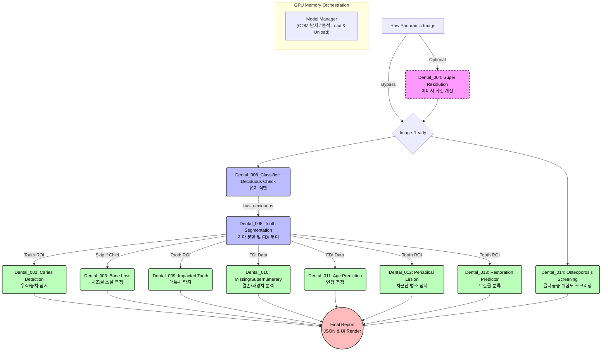

    

# Dental Panoramic Reader

## 💻 Hardware & Infrastructure
본 프로젝트의 개발과 학습은 서로 다른 두 환경에서 최적화되어 진행됩니다.

- **Development / Inference Env**: Intel Core i5-14450HX, NVIDIA RTX 4060 Laptop (8GB VRAM), 16GB RAM
- **Training Env (Main Workstation)**: AMD Ryzen 9 9900X, NVIDIA RTX 5080 (16GB VRAM), 64GB RAM

### ⚡ E2E Benchmark
- **Inference Latency**: ~2.5 seconds per panorama image (E2E full pipeline)
- **VRAM Peak**: 동적 메모리 언로드 기법 적용으로 모든 모듈(YOLO, Segmentation, Classifier 등) 구동 시 최대 **~6.5GB VRAM** 피크 유지

## ⚙️ 통합 환경 세팅
14개의 서브모듈을 모두 구동하기 위해 필요한 가중치는 `setup_env.py`를 통해 자동으로 HuggingFace에서 다운로드할 수 있습니다:
```bash
python setup_env.py
```

파노라마 방사선 사진(Panoramic Radiograph)을 입력받아 화질 개선부터 치아 식별, 병소 탐지, 결손치 파악, 매복치 분석, 치조골 소실량 측정까지 아우르는 **End-to-End 통합 진단 애플리케이션**입니다.
서로 다른 역할을 수행하는 인공지능 모듈(002, 003, 004, 008, 009, 010)을 서브모듈로 구성하고, 이를 하나의 일관된 진단 리포트로 통합(Orchestration)합니다.

## 핵심 파이프라인 (Architecture & Data Flow)

파이프라인은 데이터베이스나 외부 API 통신 없이 Python 런타임 내장 참조(In-memory Submodule Call)를 통해 최적화된 속도로 동작합니다.



### 각 서브모듈(Submodule)별 상세 역할

1. **Model Manager (Orchestrator)**
   - VRAM(GPU 메모리) 초과를 방지하기 위해 각 서브모듈의 모델 가중치를 추론 시점에만 동적으로 GPU로 올리고(Load), 사용이 끝나면 내리는(Unload) 메모리 관리 관제탑입니다.

2. **Dental_004 (Super Resolution)** *[선택]*
   - 저화질 파노라마 사진이 입력되었을 때, 딥러닝 기반으로 해상도를 끌어올려 진단 정확도를 향상시킵니다.

3. **Dental_008 (Tooth Segmentation & Classification)** *[핵심/코어]*
   - **Classifier**: 사진의 치아 발달 상태를 보고 유치(Deciduous)가 포함되어 있는지 판별합니다. 유치일 경우 성인의 뼈 기준이 적용되는 003(치조골) 모듈 등의 실행을 스킵하도록 파이프라인을 제어합니다.
   - **Segmentation**: 치아 하나하나의 테두리(BBox)와 영역(Mask)을 따내고, 위치를 기반으로 국제 치아 식별 번호(FDI)를 부여합니다. 이 데이터는 뒤이어 실행되는 모든 분석 모듈의 나침반 역할을 합니다.

4. **Dental_002 (Caries Detection)**
   - 충치(우식) 병소를 탐지합니다. 여기서 탐지된 병소의 BBox 좌표가 008에서 찾은 치아 BBox와 겹치는지(IoU) 계산하여, 최종적으로 "몇 번 치아에 충치가 있는지"를 매핑합니다.

5. **Dental_003 (Bone Loss)**
   - 치아 잇몸뼈(치조골)가 얼마나 주저앉았는지(소실되었는지) 비율로 측정합니다. (유치가 감지되면 이 단계는 자동으로 건너뜁니다.)

6. **Dental_012 (Periapical Lesion)**
   - 008에서 제공한 치아 BBox를 중심으로 이미지를 크롭하여, 치아 뿌리 끝에 염증이나 병소(치근단 병소)가 있는지 정밀 탐지합니다.

7. **Dental_013 (Restoration Classification)**
   - 각 치아 ROI 이미지를 바탕으로 치아가 Crown, Implant, Filling, RCT(신경치료) 등 어떤 치료/수복을 받은 상태인지 EfficientNet-B0를 통해 5개 클래스로 분류합니다.

9. **Dental_014 (Osteoporosis Screening)**
   - 하악 피질골을 분석하여 골감소증 및 골다공증 위험도를 스크리닝합니다. 데이터 부족으로 인한 과적합을 방지하기 위해 정답지 마스크 없이도 정규화가 가능한 **Autoencoder 기반의 End-to-End Multi-task Architecture**가 적용되어 있습니다.

9. **Dental_009 (Impacted Tooth Detection)**
   - 매복치(Impacted tooth)의 존재 여부와 매복 깊이 및 각도를 분석합니다.

10. **Dental_010 (Missing/Supernumerary Tooth)**
    - 008에서 부여된 치식(FDI) 데이터를 기반으로 결손치(Missing)나 과잉치(Supernumerary)를 식별합니다.

11. **Dental_011 (Age Prediction)**
    - 치아 발달 단계 및 맹출 패턴을 분석하여 환자의 치면 연령을 추정합니다.

## 설치 및 실행 방법

### 1. 소스코드 다운로드
Git Submodule을 포함하여 모든 모듈 코드를 다운로드합니다.
```bash
git clone --recursive https://github.com/HyunchanAn/Dental_Panoramic_Reader.git
cd Dental_Panoramic_Reader
```

### 2. 패키지 설치
각 서브모듈이 요구하는 라이브러리를 통합하여 설치합니다.
```bash
pip install -r requirements.txt
```

### 3. 애플리케이션 실행
```bash
streamlit run app.py
```

## 시스템 요구사항
- **GPU**: NVIDIA RTX 4060 Laptop (8GB VRAM) 수준에 맞추어 `core/model_manager.py`가 구동 시나리오별 GPU 메모리 스왑 및 캐시 클리어링(PyTorch VRAM 최적화)을 자동 수행합니다.
- **OS**: Windows / Linux 지원

## 📚 데이터셋 출처 (Datasets)

본 프로젝트의 각 모듈 학습 및 검증을 위해 사용된 주요 오픈/퍼블릭 데이터셋은 다음과 같습니다:

1. **Tufts Dental Database**
   - **사용 모듈**: Dental_008 (Tooth Segmentation), Dental_002 (Caries Detection) 등 기본 악안면 분석.
   - **설명**: 파노라마 엑스레이 이미지에서의 치아 인스턴스 분할 및 질환(우식 등) 탐지를 위한 기본 베이스라인 데이터셋.

2. **Sharda Dataverse Dataset (Osteoporosis Risk Screening)**
   - **사용 모듈**: Dental_014 (Phase 1: Mandible ROI U-Net Extraction)
   - **설명**: 초기 하악골(Mandible) 형태 및 ROI(관심 영역) 검출 모델 학습을 위해 사용된 파노라마 데이터셋. (단, 과도한 증강과 환자 식별자 손실 문제로 014 모듈의 Phase 2 분류 학습에서는 배제됨)

3. **BRAR-anchored multimodal dataset**
   - **사용 모듈**: Dental_014 (Phase 2: Osteopenia / Osteoporosis Classifier)
   - **설명**: 환자의 실제 임상 골흡수 지표가 신뢰성 있게 매핑(Anchored)된 다중 모달리티 데이터셋. `정상(C1)`, `골감소증(C2)`, `골다공증(C3)` 분류를 위한 최종 Classifier 훈련의 Single Source of Truth로 도입.

## 라이선스
MIT License


## 개요
이 레포지토리는 치과 AI 모듈러 시스템의 일부입니다.
