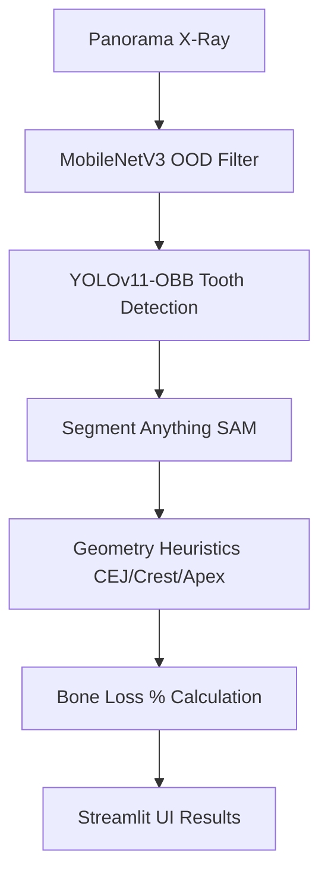
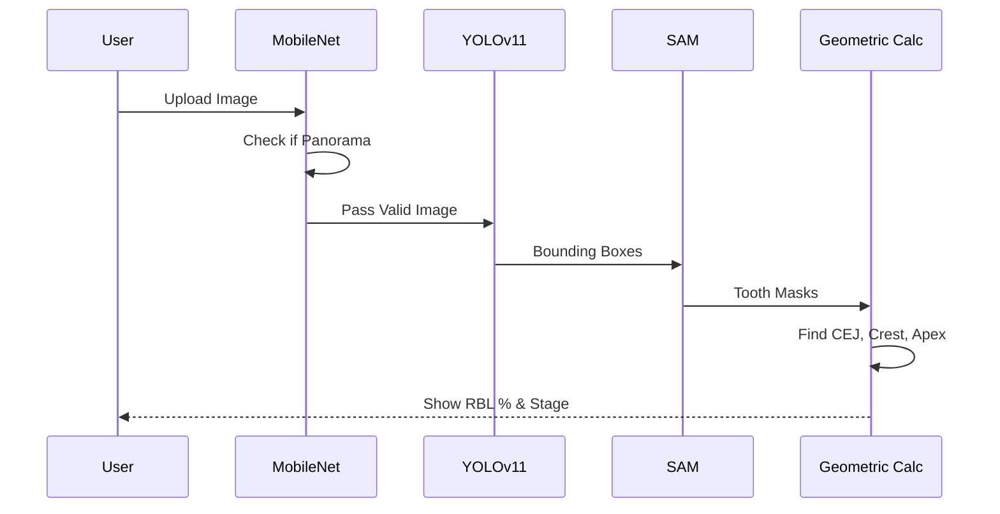

# Pano Bone Loss Measurement

딥러닝을 활용하여 파노라마 방사선 사진에서 치아를 검출하고, 제로샷 기반 마스킹(SAM)을 통해 주요 랜드마크(CEJ, Crest, Apex)를 추출하여 치주염에 따른 치조골 소실량(RBL, Radiographic Bone Loss)을 자동으로 측정하는 AI 시스템입니다.

## Technical Architecture & Workflow

### Architecture Diagram

### Sequence Diagram

##  Key Features
- **OOD Rejection Filter**: MobileNetV3를 기반으로 입력 이미지가 파노라마인지 여부를 사전에 판별하여 치근단/일반 사진 등 잘못된 입력을 차단합니다.
- **Tooth Detection**: `ufba-425` 데이터셋으로 커스텀 학습된 YOLOv11-OBB 모델을 통해 개별 치아 위치 및 각도를 정확하게 바운딩합니다.
- **Zero-shot Landmark Detection**: Meta의 SAM(Segment Anything) 파운데이션 모델을 결합하여 치아의 픽셀 단위 마스크를 추출하고, 외곽선 기하학 분석을 통해 주요 포인트(CEJ, Alveolar Crest, Root Apex)를 유추합니다.
- **Bone Loss Calculation**: 추정된 랜드마크 좌표를 통해 CEJ-Apex 대비 CEJ-Crest 길이 비율을 계산, 임상적인 골소실 퍼센트(%)를 산출합니다.
- **Streamlit UI**: 의료진 및 사용자가 엑스레이 이미지를 업로드하고 즉시 시각화된 결과를 확인할 수 있는 웹 인터페이스를 제공합니다.

## ️ Tech Stack
- **Deep Learning**: PyTorch, Ultralytics(YOLOv11), Segment-Anything, Torchvision
- **Computer Vision**: OpenCV, Scipy
- **Web/UI**: Streamlit

##  Future Work (앞으로 해야 할 일)
- **1. SAM 휴리스틱 정밀도 개선 및 수동 라벨링 데이터셋 구축**
  - 현재 SAM 기반 마스크 추출 후 기하학 수식(y축 기준 30%, 40% 등)으로 랜드마크를 추정하고 있으므로, 다양한 치아 형태(매복치, 기형치 등)에 취약할 수 있습니다.
  - 추후 전문의가 직접 어노테이션한 랜드마크 데이터셋(Keypoint GT)을 구축하여 YOLO-Pose 형태의 End-to-End 회귀 모델로 고도화해야 합니다.
- **2. YOLO 추론 로직 정상화 및 후처리(NMS) 강화**
  - `models/detector.py` 내부에 임시(Dummy)로 작성된 반환 코드를 실제 `self.model.predict` 결과로 교체하고, 중복 검출 방지를 위한 NMS 로직을 고도화해야 합니다.
- **3. 임상 평가 및 Bone Loss 병기(Stage) 판정 추가**
  - 측정된 RBL(%) 수치를 바탕으로 실제 치주질환 진단 가이드라인(AAP/EFP Classification 등)에 따른 Stage I~IV 자동 분류 기능을 추가해야 합니다.
