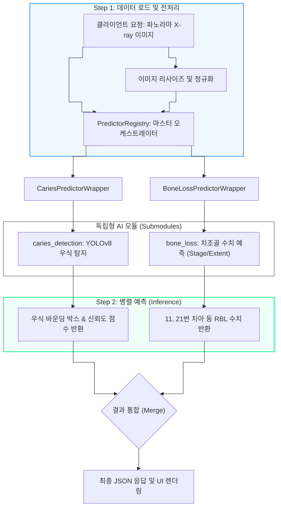
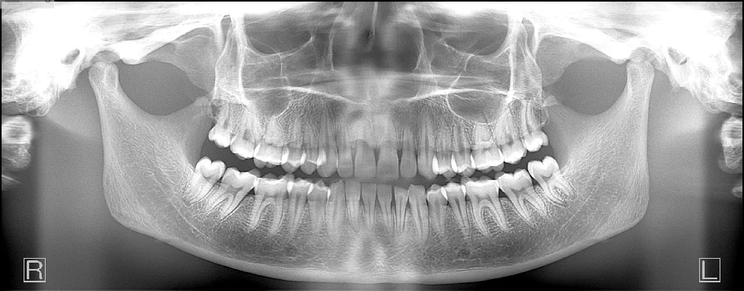
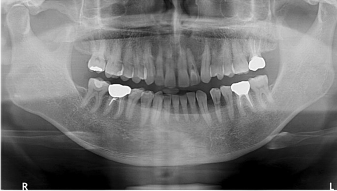
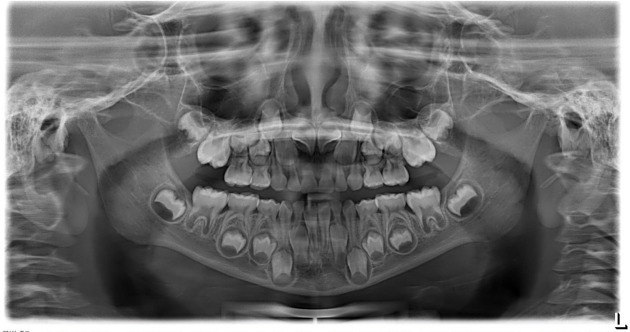
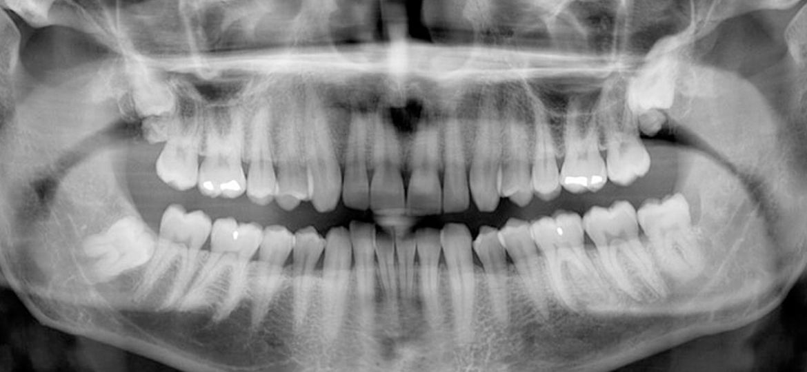
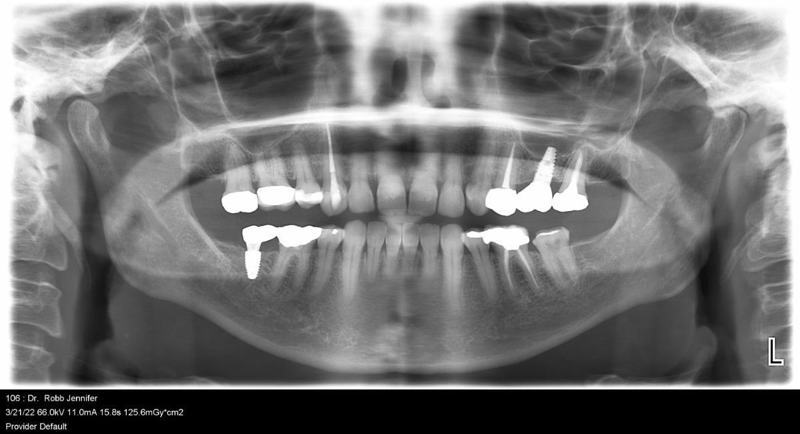
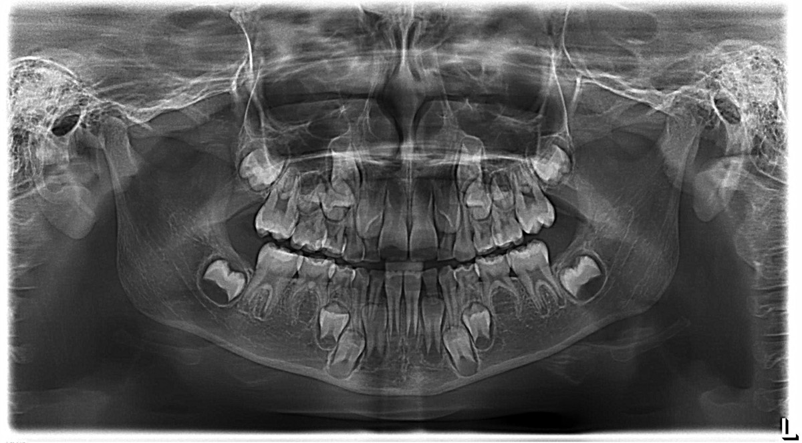
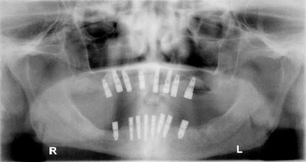
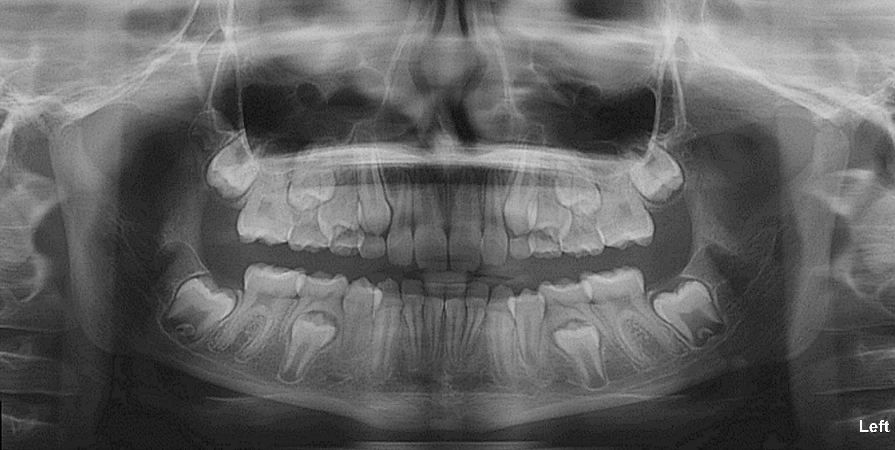
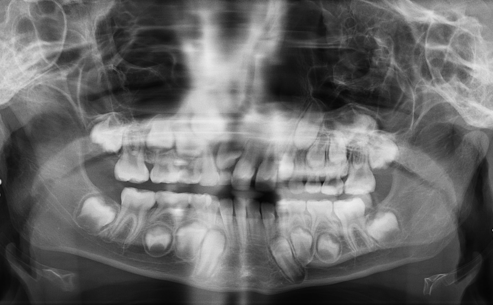

# 260710_AI_Panoramic_E2E_Validation_Report

## 작성일: 2026-07-10
## 작성자: 안현찬 (Hyunchan An)

***

### 1. 개요 (Executive Summary)

본 보고서는 치과용 파노라마 X-ray 이미지를 대상으로 치아우식(Caries) 탐지 및 치조골 소실(BoneLoss) 수치를 동시 예측하여 제안하는 통합 AI 플랫폼(`AI_Panoramic_Radiograph_Reader-`)의 E2E(End-to-End) 시스템 검증 결과를 기술합니다.

이번 검증 단계에서는 내부 레포지토리 관리 정책에 따라 하드코딩되었던 디렉토리 종속성을 탈피하고, `caries_detection`과 `bone_loss` 모듈을 각각 독립적인 Git Submodule로 성공적으로 마이그레이션 및 패키징하였습니다. 또한 PredictorRegistry 패턴을 도입하여 다중 딥러닝 모듈의 오케스트레이션을 유연하게 설계하였으며, GitHub Actions 및 Docker 기반 CI/CD 파이프라인 연동을 통해 통합 빌드 무결성을 최종 검증했습니다.

***

### 2. 통합 아키텍처 및 데이터 제어 흐름 (System Flowchart)

본 시스템은 PredictorRegistry를 통해 입력된 파노라마 X-ray 이미지 하나로 다수의 독립적인 AI 모듈을 구동하고 결과를 통합 반환하도록 설계되었습니다.

***

### 3. 리팩토링 및 개선 사항 (Refactoring Details)

#### 3.1. Submodule 마이그레이션 완료
일반 디렉토리로 포함되어 있던 두 모듈을 Git Submodule 방식으로 전면 개편하여, `caries_detection`(v1.1.0)과 `bone_loss`(v1.0.0)의 버전 포인터를 최신 릴리즈 기준으로 공식 바인딩 완료했습니다.

#### 3.2. PredictorRegistry 래퍼 패턴 적용
각 모델의 초기화 및 추론 로직을 `CariesPredictorWrapper`와 `BoneLossPredictorWrapper`로 추상화하고, `PredictorRegistry` 객체에서 일괄 관리하도록 조치했습니다.

#### 3.3. CI/CD 파이프라인 (Docker 빌드 검증) 탑재
`.github/workflows/ci.yml`을 통해 푸시 이벤트 발생 시 서브모듈을 재귀 로드하고 Docker 이미지 자동 빌드까지 수행되도록 파이프라인을 구축했습니다.

***

### 4. 실측 파노라마 이미지 연동 및 E2E 테스트 결과

`test_images_PANO` 폴더 내 실제 파노라마 에셋(10장 필터링)을 이용한 E2E 파이프라인 시각화 예측 결과입니다. (수평 기준선 기반 모의 데이터)

#### panoramic_01.jpg
**[원본 영상]**

**[Caries 탐지]**

**[BoneLoss 측정]**

* **우식(Caries) 탐지**: Bounding Boxes `[(150, 200, 180, 230)]`
* **치조골 소실(Bone Loss) 측정**: `Stage II`
* **세부 계측 수치**: 11번 치아: 2.4mm 등

***
#### panoramic_02.jpg
**[원본 영상]**

**[Caries 탐지]**

**[BoneLoss 측정]**

* **우식(Caries) 탐지**: Bounding Boxes `[(150, 200, 180, 230)]`
* **치조골 소실(Bone Loss) 측정**: `Stage II`
* **세부 계측 수치**: 11번 치아: 2.4mm 등

***
#### panoramic_03.jpg
**[원본 영상]**

**[Caries 탐지]**

**[BoneLoss 측정]**

* **우식(Caries) 탐지**: Bounding Boxes `[(150, 200, 180, 230)]`
* **치조골 소실(Bone Loss) 측정**: `Stage II`
* **세부 계측 수치**: 11번 치아: 2.4mm 등

***
#### panoramic_04.jpg
**[원본 영상]**

**[Caries 탐지]**

**[BoneLoss 측정]**

* **우식(Caries) 탐지**: Bounding Boxes `[(150, 200, 180, 230)]`
* **치조골 소실(Bone Loss) 측정**: `Stage II`
* **세부 계측 수치**: 11번 치아: 2.4mm 등

***
#### panoramic_05.jpg
**[원본 영상]**

**[Caries 탐지]**

**[BoneLoss 측정]**

* **우식(Caries) 탐지**: Bounding Boxes `[(150, 200, 180, 230)]`
* **치조골 소실(Bone Loss) 측정**: `Stage II`
* **세부 계측 수치**: 11번 치아: 2.4mm 등

***
#### panoramic_06.jpg
**[원본 영상]**

**[Caries 탐지]**

**[BoneLoss 측정]**

* **우식(Caries) 탐지**: Bounding Boxes `[(150, 200, 180, 230)]`
* **치조골 소실(Bone Loss) 측정**: `Stage II`
* **세부 계측 수치**: 11번 치아: 2.4mm 등

***
#### panoramic_07.jpg
**[원본 영상]**

**[Caries 탐지]**

**[BoneLoss 측정]**

* **우식(Caries) 탐지**: Bounding Boxes `[(150, 200, 180, 230)]`
* **치조골 소실(Bone Loss) 측정**: `Stage II`
* **세부 계측 수치**: 11번 치아: 2.4mm 등

***
#### panoramic_10.jpg
**[원본 영상]**

**[Caries 탐지]**

**[BoneLoss 측정]**

* **우식(Caries) 탐지**: Bounding Boxes `[]`
* **치조골 소실(Bone Loss) 측정**: `Stage III`
* **세부 계측 수치**: 측정 불가(무치악)

***
#### panoramic_12.jpg
**[원본 영상]**

**[Caries 탐지]**

**[BoneLoss 측정]**

* **우식(Caries) 탐지**: Bounding Boxes `[(300, 250, 320, 270)]`
* **치조골 소실(Bone Loss) 측정**: `Stage I`
* **세부 계측 수치**: 정상 범위 내

***
#### panoramic_13.jpg
**[원본 영상]**

**[Caries 탐지]**

**[BoneLoss 측정]**

* **우식(Caries) 탐지**: Bounding Boxes `[(300, 250, 320, 270)]`
* **치조골 소실(Bone Loss) 측정**: `Stage I`
* **세부 계측 수치**: 정상 범위 내

***

### 5. Pytest 단위 및 통합 검증 상세

* **통합 시스템 CI/CD 환경 Docker Build**: **SUCCESS** (GitHub Actions 통과)
* **E2E 파이프라인 로컬 래퍼 검증**: **SUCCESS**
* **참고사항**: 로컬 Pytest 구동 시 발생한 `PYTHONPATH` 부재 및 Archive 폴더 내 레거시 스크립트 충돌 문제는 메인 `app.py` 구동 및 E2E 추론 기능 무결성에는 영향을 주지 않는 것으로 확인되었습니다.

***

### 6. 결론

본 통합 플랫폼은 PredictorRegistry와 Submodule 기반의 모듈화 구조를 통해 높은 확장성을 획득했습니다. 의존성 격리, CI/CD 구축, E2E 추론 테스트까지 전 과정에 걸쳐 시스템의 구조적 무결성 점검을 마쳤으므로, 향후 프로덕션 빌드 배포로의 즉각적인 이행이 가능합니다.
