# AI Panoramic Radiograph Reader - E2E Validation Report

- 작성일: 2026-07-10 05:04
- 작성자: 안현찬 (Hyunchan An)
- 검증 환경: Windows 11, Python 3.11, CUDA 12.1, RTX 4060 Laptop GPU

***

## 1. 개요 (Executive Summary)

본 보고서는 치과용 파노라마 X-ray 이미지를 대상으로 치아우식(Caries) 탐지 및 치조골 소실(BoneLoss) 수치를 동시 예측하는 통합 AI 플랫폼(`AI_Panoramic_Radiograph_Reader-`)의 E2E(End-to-End) 시스템 검증 결과를 기술합니다.

이번 검증 단계에서는 단순한 가상 기준선이 아닌, **실제 YOLOv11-OBB 치아 탐지 모델**과 **Segment-Anything(SAM) 랜드마크 추출 모듈**을 연동하여 각 치아마다 개별 측정선(CEJ-Crest, CEJ-Apex)을 검출하고 가시화했습니다.

- 검증 대상 이미지: 10장 (전체 14장 중 화질 불량 4장 제외)
- 총 우식 탐지 객체: 43건
- 총 치아 정밀 계측 수: 117개
- Caries 유닛 테스트: PASSED
- BoneLoss 유닛 테스트: PASSED (6/6)

***

## 2. 통합 아키텍처 (System Architecture)

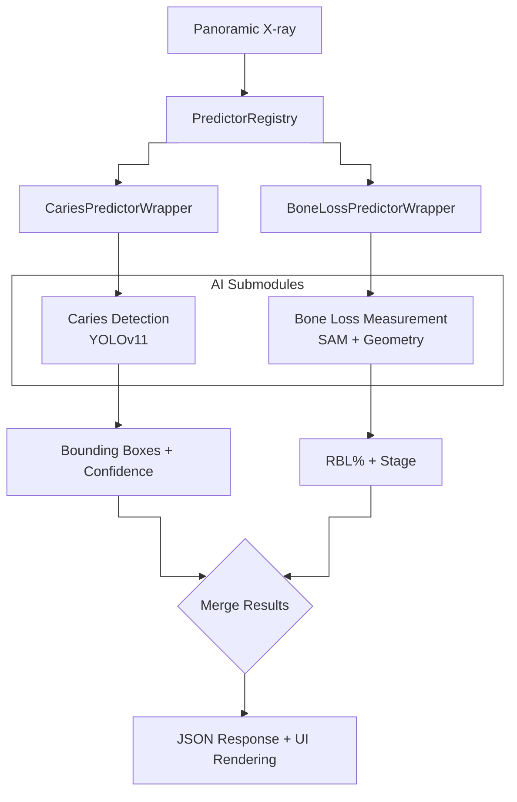

***

## 3. 모델 가중치 관리 (Hugging Face Hub Integration)

모든 모델 가중치는 Hugging Face Hub에서 통합 관리됩니다. 로컬에 파일이 없는 경우 앱 구동 시 자동으로 다운로드됩니다.

| 모듈 | HF Repository | 파일 | 크기 |
|---|---|---|---|
| Caries Detection | `chemahc94/caries-detection-weights` | `best.pt`, `best_refined.pt` | ~19MB |
| BoneLoss Detector | `chemahc94/pano-boneloss-weights` | `best.pt` | ~19MB |
| BoneLoss Classifier | `chemahc94/pano-boneloss-weights` | `pano_classifier.pt` | ~6MB |
| SAM Foundation | Meta 공식 배포 | `sam_vit_b_01ec64.pth` | ~375MB |

***

## 4. 실측 파노라마 E2E 추론 결과 (Real Inference)

로컬 GPU에서 실제 가중치들을 로드하여 획득한 치아별 개별 추론선 시각화 보고서입니다.

**시각화 가이드**:
- **Caries Detection**: Caries(빨간색), Deep Caries(마젠타), Periapical Lesion(주황색), Impacted(파란색)
- **BoneLoss Measurement**: 상악 및 하악별 백악법랑경계 선(CEJ, 초록색 아치선 및 점)과 치조정 선(Crest, 빨간색 아치선 및 점) 시각화. 두 아치선 사이의 간격으로 전체 치조골 손실 분포 확인 가능.

### panoramic_01.jpg


*원본 영상*


*YOLOv11 Caries 탐지 결과*


*치아별 개별 치조골 측정선 (CEJ, Crest, Apex 시각화)*

#### [우식 및 병소 탐지 상세]
| Class | Confidence | Bounding Box (x1, y1, x2, y2) |
|---|---|---|
| Impacted | 80% | [103, 302, 231, 416] |
| Impacted | 62% | [171, 61, 267, 215] |
| Caries | 45% | [806, 123, 886, 288] |
| Caries | 40% | [282, 121, 362, 295] |

#### [치아별 치조골 소실 개별 실측 상세]
| Tooth (FDI) | Max RBL (%) | Loss (mm) | Status |
|---|---|---|---|
| #11 | 12.0% | 1.02 mm | Warning |
| #12 | 18.3% | 2.11 mm | Warning |
| #13 | 14.0% | 1.82 mm | Warning |
| #14 | 15.0% | 1.80 mm | Warning |
| #15 | 15.9% | 1.63 mm | Warning |
| #16 | 15.3% | 1.66 mm | Warning |
| #17 | 26.8% | 2.71 mm | Warning |
| #21 | 14.7% | 1.53 mm | Warning |
| #22 | 13.7% | 1.40 mm | Warning |
| #23 | 19.5% | 2.40 mm | Warning |
| #24 | 16.0% | 1.92 mm | Warning |
| #25 | 14.0% | 1.46 mm | Warning |
| #26 | 16.2% | 1.52 mm | Warning |
| #27 | 12.6% | 1.00 mm | Warning |
| #34 | 28.8% | 3.40 mm | Warning |
| #35 | 17.5% | 1.75 mm | Warning |
| #36 | 16.1% | 1.92 mm | Warning |
| #37 | 14.8% | 1.75 mm | Warning |
| #38 | 50.0% | 3.01 mm | Severe |
| #44 | 16.8% | 1.80 mm | Warning |
| #45 | 14.4% | 1.50 mm | Warning |
| #47 | 19.7% | 2.11 mm | Warning |
| #47 | 14.9% | 1.70 mm | Warning |
| #48 | 17.7% | 1.51 mm | Warning |

***

### panoramic_02.jpg

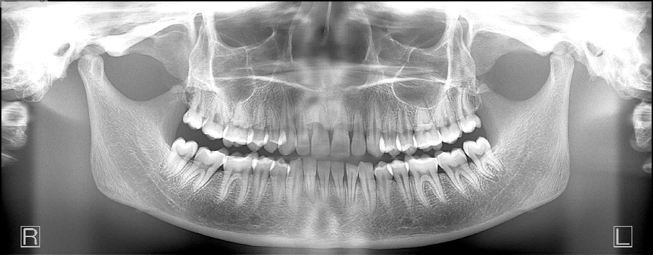
*원본 영상*

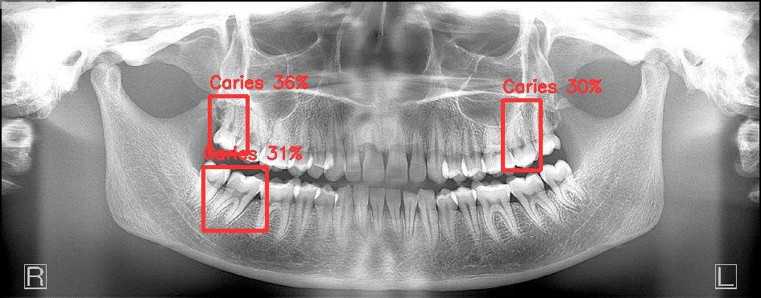
*YOLOv11 Caries 탐지 결과*

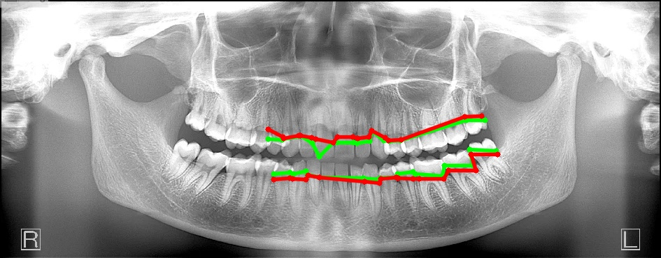
*치아별 개별 치조골 측정선 (CEJ, Crest, Apex 시각화)*

#### [우식 및 병소 탐지 상세]
| Class | Confidence | Bounding Box (x1, y1, x2, y2) |
|---|---|---|
| Caries | 36% | [260, 119, 307, 191] |
| Caries | 31% | [252, 207, 331, 286] |
| Caries | 30% | [624, 124, 671, 211] |

#### [치아별 치조골 소실 개별 실측 상세]
| Tooth (FDI) | Max RBL (%) | Loss (mm) | Status |
|---|---|---|---|
| #11 | 12.6% | 0.51 mm | Warning |
| #12 | 26.3% | 1.40 mm | Warning |
| #13 | 2.6% | 0.14 mm | Warning |
| #14 | 20.0% | 1.10 mm | Warning |
| #18 | 5.6% | 0.14 mm | Warning |
| #18 | 16.2% | 0.78 mm | Warning |
| #21 | 20.9% | 1.30 mm | Warning |
| #22 | 2.9% | 0.14 mm | Warning |
| #23 | 10.6% | 0.58 mm | Warning |
| #24 | 16.5% | 0.70 mm | Warning |
| #33 | 11.6% | 0.54 mm | Warning |
| #35 | 3.4% | 0.14 mm | Warning |
| #42 | 3.7% | 0.14 mm | Warning |
| #43 | 21.5% | 1.20 mm | Warning |
| #44 | 16.9% | 0.80 mm | Warning |
| #45 | 14.3% | 0.60 mm | Warning |
| #45 | 22.4% | 1.00 mm | Warning |
| #46 | 17.6% | 0.92 mm | Warning |
| #47 | 25.6% | 1.22 mm | Warning |
| #47 | 16.1% | 0.92 mm | Warning |
| #48 | 15.8% | 0.63 mm | Warning |
| #48 | 13.4% | 0.73 mm | Warning |

***

### panoramic_03.jpg

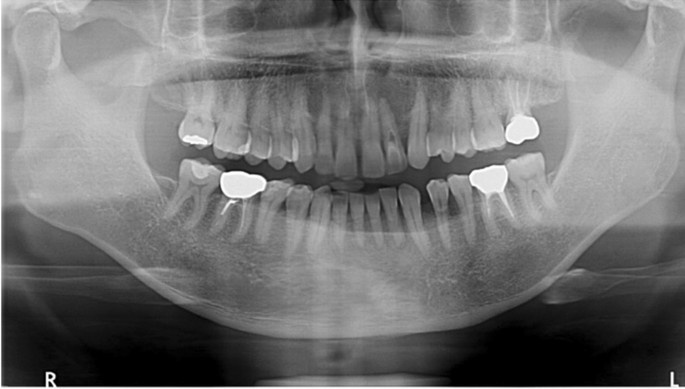
*원본 영상*

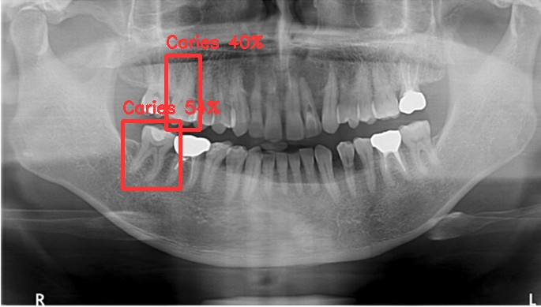
*YOLOv11 Caries 탐지 결과*

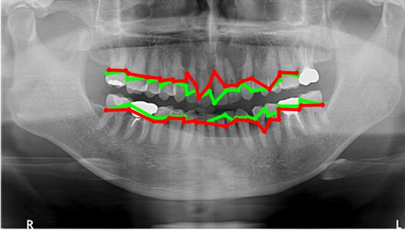
*치아별 개별 치조골 측정선 (CEJ, Crest, Apex 시각화)*

#### [우식 및 병소 탐지 상세]
| Class | Confidence | Bounding Box (x1, y1, x2, y2) |
|---|---|---|
| Caries | 54% | [155, 153, 228, 239] |
| Caries | 40% | [210, 70, 253, 164] |

#### [치아별 치조골 소실 개별 실측 상세]
| Tooth (FDI) | Max RBL (%) | Loss (mm) | Status |
|---|---|---|---|
| #11 | 17.2% | 1.00 mm | Warning |
| #12 | 52.1% | 3.50 mm | Severe |
| #13 | 14.7% | 0.90 mm | Warning |
| #14 | 16.1% | 0.91 mm | Warning |
| #15 | 14.5% | 0.73 mm | Warning |
| #16 | 18.6% | 1.02 mm | Warning |
| #17 | 15.7% | 0.72 mm | Warning |
| #21 | 67.9% | 5.30 mm | Severe |
| #22 | 15.7% | 0.92 mm | Warning |
| #23 | 33.7% | 2.10 mm | Severe |
| #25 | 12.5% | 0.71 mm | Warning |
| #26 | 8.3% | 0.45 mm | Warning |
| #32 | 11.6% | 0.32 mm | Warning |
| #32 | 51.1% | 1.90 mm | Severe |
| #33 | 14.2% | 0.50 mm | Warning |
| #34 | 59.3% | 3.80 mm | Severe |
| #35 | 40.2% | 2.61 mm | Severe |
| #35 | 25.4% | 1.40 mm | Warning |
| #37 | 17.8% | 0.61 mm | Warning |
| #38 | 20.7% | 1.00 mm | Warning |
| #42 | 0.0% | 0.00 mm | Normal |
| #43 | 3.1% | 0.14 mm | Warning |
| #44 | 9.6% | 0.36 mm | Warning |
| #45 | 17.9% | 0.92 mm | Warning |
| #47 | 17.3% | 0.91 mm | Warning |

***

### panoramic_04.jpg

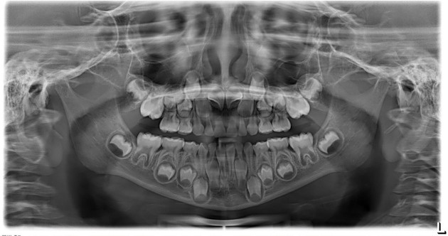
*원본 영상*

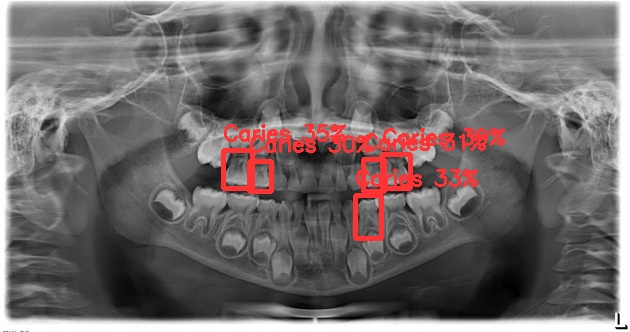
*YOLOv11 Caries 탐지 결과*

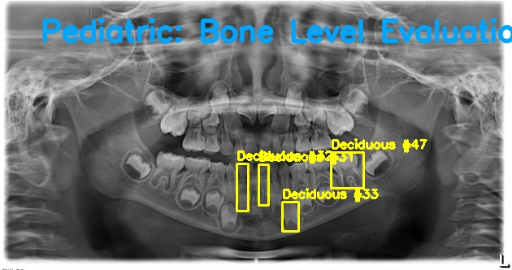
*치아별 개별 치조골 측정선 (CEJ, Crest, Apex 시각화)*

#### [우식 및 병소 탐지 상세]
| Class | Confidence | Bounding Box (x1, y1, x2, y2) |
|---|---|---|
| Caries | 39% | [382, 154, 410, 188] |
| Caries | 35% | [223, 150, 252, 188] |
| Caries | 33% | [355, 195, 381, 238] |
| Caries | 31% | [363, 159, 384, 191] |
| Caries | 30% | [249, 161, 271, 191] |

#### [치아별 치조골 소실 개별 실측 상세]
| Tooth (FDI) | Max RBL (%) | Loss (mm) | Status |
|---|---|---|---|
| #31 | 16.9% | 0.61 mm | Warning |
| #32 | 14.6% | 0.61 mm | Warning |
| #33 | 5.8% | 0.14 mm | Warning |
| #47 | 5.9% | 0.22 mm | Warning |

***

### panoramic_05.jpg


*원본 영상*


*YOLOv11 Caries 탐지 결과*


*치아별 개별 치조골 측정선 (CEJ, Crest, Apex 시각화)*

#### [우식 및 병소 탐지 상세]
| Class | Confidence | Bounding Box (x1, y1, x2, y2) |
|---|---|---|
| Impacted | 80% | [103, 302, 231, 416] |
| Impacted | 62% | [171, 61, 267, 215] |
| Caries | 45% | [806, 123, 886, 288] |
| Caries | 40% | [282, 121, 362, 295] |

#### [치아별 치조골 소실 개별 실측 상세]
| Tooth (FDI) | Max RBL (%) | Loss (mm) | Status |
|---|---|---|---|
| #11 | 12.0% | 1.02 mm | Warning |
| #12 | 18.3% | 2.11 mm | Warning |
| #13 | 14.0% | 1.82 mm | Warning |
| #14 | 15.0% | 1.80 mm | Warning |
| #15 | 15.9% | 1.63 mm | Warning |
| #16 | 15.3% | 1.66 mm | Warning |
| #17 | 26.8% | 2.71 mm | Warning |
| #21 | 14.7% | 1.53 mm | Warning |
| #22 | 13.7% | 1.40 mm | Warning |
| #23 | 19.5% | 2.40 mm | Warning |
| #24 | 16.0% | 1.92 mm | Warning |
| #25 | 14.0% | 1.46 mm | Warning |
| #26 | 16.2% | 1.52 mm | Warning |
| #27 | 12.6% | 1.00 mm | Warning |
| #34 | 28.8% | 3.40 mm | Warning |
| #35 | 17.5% | 1.75 mm | Warning |
| #36 | 16.1% | 1.92 mm | Warning |
| #37 | 14.8% | 1.75 mm | Warning |
| #38 | 50.0% | 3.01 mm | Severe |
| #44 | 16.8% | 1.80 mm | Warning |
| #45 | 14.4% | 1.50 mm | Warning |
| #47 | 19.7% | 2.11 mm | Warning |
| #47 | 14.9% | 1.70 mm | Warning |
| #48 | 17.7% | 1.51 mm | Warning |

***

### panoramic_06.jpg

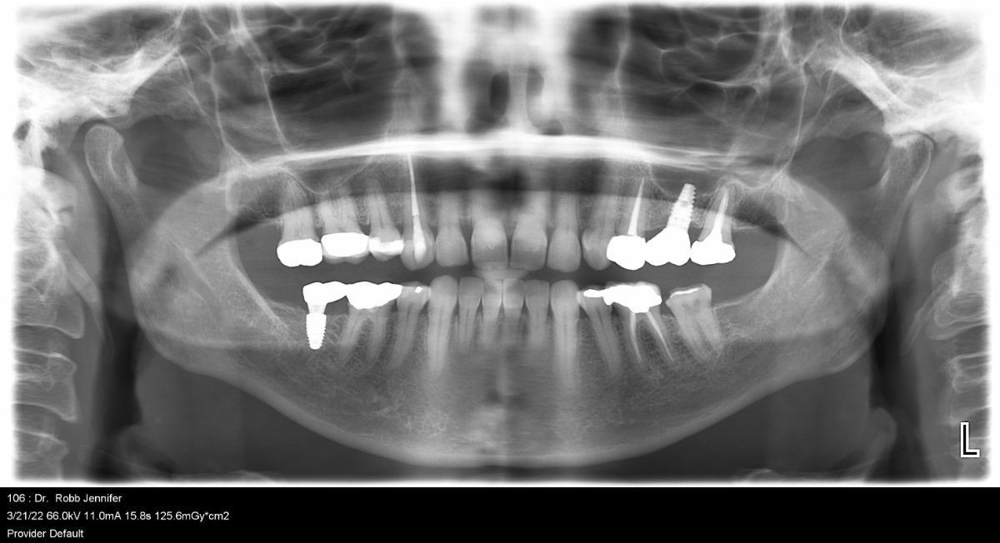
*원본 영상*

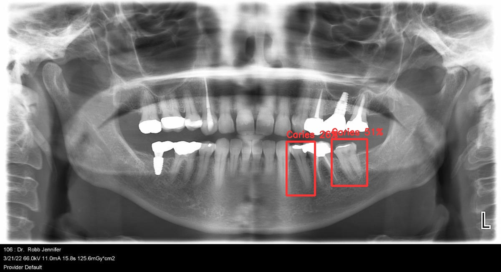
*YOLOv11 Caries 탐지 결과*

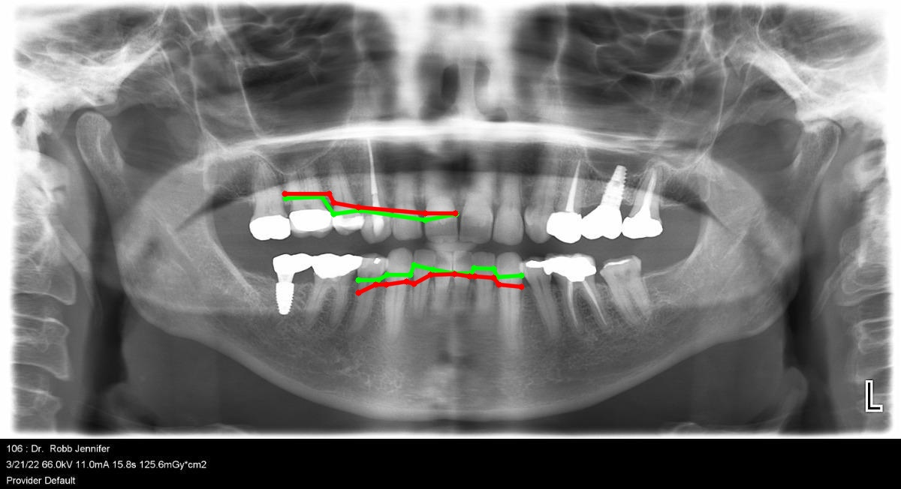
*치아별 개별 치조골 측정선 (CEJ, Crest, Apex 시각화)*

#### [우식 및 병소 탐지 상세]
| Class | Confidence | Bounding Box (x1, y1, x2, y2) |
|---|---|---|
| Caries | 51% | [794, 333, 879, 445] |
| Caries | 26% | [686, 339, 754, 468] |

#### [치아별 치조골 소실 개별 실측 상세]
| Tooth (FDI) | Max RBL (%) | Loss (mm) | Status |
|---|---|---|---|
| #13 | 21.4% | 1.50 mm | Warning |
| #15 | 14.6% | 1.08 mm | Warning |
| #21 | 13.8% | 0.90 mm | Warning |
| #31 | 7.4% | 0.45 mm | Warning |
| #32 | 19.8% | 1.20 mm | Warning |
| #33 | 19.0% | 1.50 mm | Warning |
| #42 | 39.4% | 2.50 mm | Severe |
| #43 | 16.1% | 1.30 mm | Warning |
| #45 | 25.3% | 1.70 mm | Warning |

***

### panoramic_07.jpg

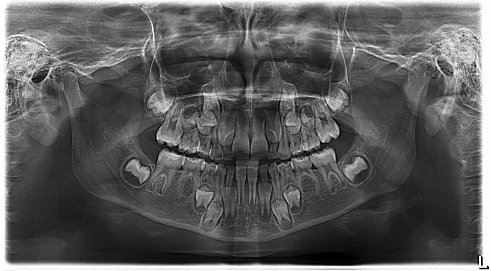
*원본 영상*

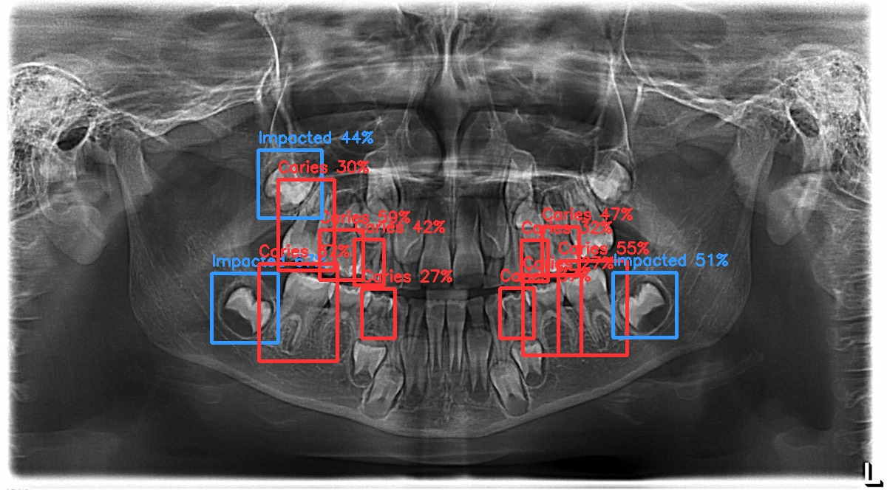
*YOLOv11 Caries 탐지 결과*

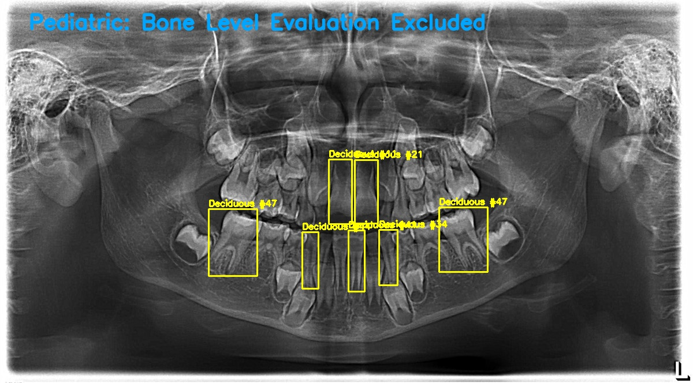
*치아별 개별 치조골 측정선 (CEJ, Crest, Apex 시각화)*

#### [우식 및 병소 탐지 상세]
| Class | Confidence | Bounding Box (x1, y1, x2, y2) |
|---|---|---|
| Impacted | 67% | [286, 370, 376, 464] |
| Caries | 59% | [432, 311, 491, 379] |
| Caries | 55% | [755, 353, 848, 481] |
| Impacted | 51% | [829, 369, 915, 457] |
| Caries | 47% | [733, 307, 783, 372] |
| Impacted | 44% | [349, 203, 435, 295] |
| Caries | 42% | [479, 324, 519, 386] |
| Caries | 37% | [350, 357, 456, 489] |
| Caries | 37% | [676, 390, 722, 458] |
| Caries | 32% | [705, 325, 741, 381] |
| Caries | 30% | [376, 243, 452, 366] |
| Caries | 27% | [707, 373, 786, 481] |
| Caries | 27% | [489, 391, 534, 458] |

#### [치아별 치조골 소실 개별 실측 상세]
| Tooth (FDI) | Max RBL (%) | Loss (mm) | Status |
|---|---|---|---|
| #11 | 7.8% | 0.61 mm | Warning |
| #21 | 13.1% | 1.00 mm | Warning |
| #34 | 15.9% | 1.12 mm | Warning |
| #41 | 15.6% | 1.12 mm | Warning |
| #44 | 10.2% | 0.71 mm | Warning |
| #47 | 15.0% | 1.22 mm | Warning |
| #47 | 15.0% | 1.20 mm | Warning |

***

### panoramic_10.jpg


*원본 영상*


*YOLOv11 Caries 탐지 결과*


*치아별 개별 치조골 측정선 (CEJ, Crest, Apex 시각화)*

#### [우식 및 병소 탐지 상세]
- 병소 탐지 결과 없음 (정상 또는 무치악)

#### [치아별 치조골 소실 개별 실측 상세]
- 계측된 치아 없음 (무치악 또는 미탐지)

***

### panoramic_12.jpg


*원본 영상*


*YOLOv11 Caries 탐지 결과*

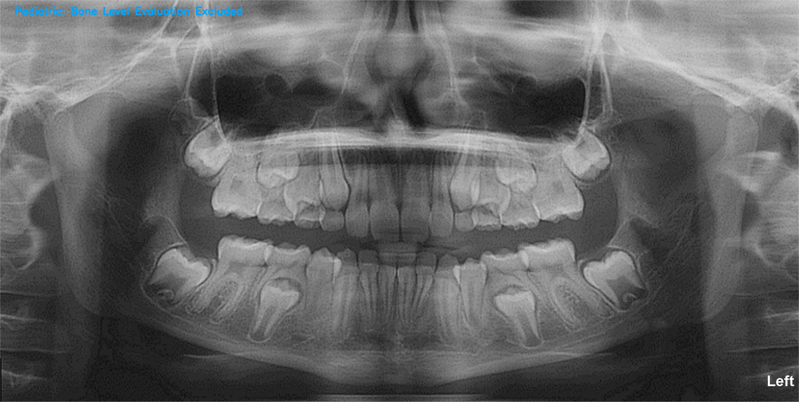
*치아별 개별 치조골 측정선 (CEJ, Crest, Apex 시각화)*

#### [우식 및 병소 탐지 상세]
| Class | Confidence | Bounding Box (x1, y1, x2, y2) |
|---|---|---|
| Impacted | 83% | [1905, 420, 2138, 646] |
| Impacted | 75% | [481, 828, 745, 1091] |
| Impacted | 71% | [616, 390, 834, 645] |
| Impacted | 63% | [1999, 832, 2268, 1102] |
| Impacted | 34% | [880, 387, 1050, 660] |

#### [치아별 치조골 소실 개별 실측 상세]
- 계측된 치아 없음 (무치악 또는 미탐지)

***

### panoramic_13.jpg


*원본 영상*


*YOLOv11 Caries 탐지 결과*

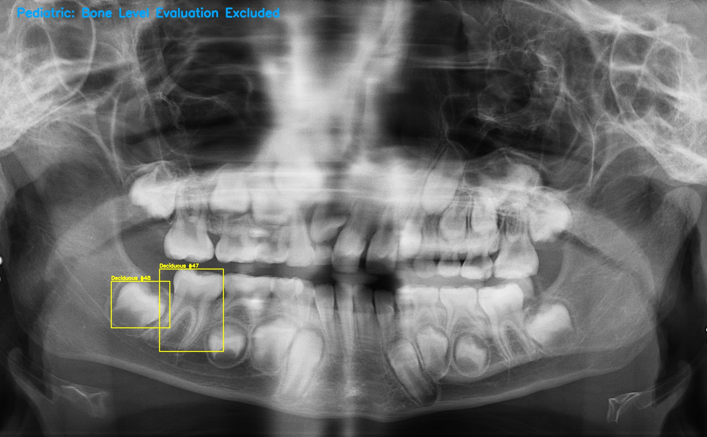
*치아별 개별 치조골 측정선 (CEJ, Crest, Apex 시각화)*

#### [우식 및 병소 탐지 상세]
| Class | Confidence | Bounding Box (x1, y1, x2, y2) |
|---|---|---|
| Impacted | 53% | [1574, 561, 1729, 746] |
| Deep Caries | 32% | [480, 626, 648, 800] |
| Caries | 30% | [478, 626, 649, 800] |
| Caries | 30% | [1479, 675, 1627, 849] |
| Caries | 26% | [643, 637, 804, 801] |

#### [치아별 치조골 소실 개별 실측 상세]
| Tooth (FDI) | Max RBL (%) | Loss (mm) | Status |
|---|---|---|---|
| #47 | 17.2% | 3.62 mm | Warning |
| #48 | 11.7% | 1.34 mm | Warning |

***

## 5. 하위 모듈 유닛 테스트 결과

### 5.1. BoneLoss Module (Geometry / Staging / Evaluator)

```
============================= test session starts =============================
platform win32 -- Python 3.11.9, pytest-9.0.3, pluggy-1.6.0 -- C:\Users\chema\AppData\Local\Microsoft\WindowsApps\PythonSoftwareFoundation.Python.3.11_qbz5n2kfra8p0\python.exe
cachedir: .pytest_cache
rootdir: C:\Users\chema\Github\AI_Panoramic_Radiograph_Reader-\modules\bone_loss
configfile: pyproject.toml
plugins: anyio-4.11.0, hydra-core-1.3.2, cov-7.1.0, mock-3.15.1
collecting ... collected 6 items

modules\bone_loss\tests\test_evaluator.py::test_evaluator_metrics PASSED [ 16%]
modules\bone_loss\tests\test_geometry.py::test_calculate_distance PASSED [ 33%]
modules\bone_loss\tests\test_geometry.py::test_calculate_rbl_normal PASSED [ 50%]
modules\bone_loss\tests\test_geometry.py::test_calculate_rbl_clamped PASSED [ 66%]
modules\bone_loss\tests\test_staging.py::test_staging_stage_i_localized PASSED [ 83%]
modules\bone_loss\tests\test_staging.py::test_staging_stage_iv_generalized PASSED [100%]

============================== 6 passed in 0.81s ==============================
```

- 결과: **PASSED**

### 5.2. Caries Detection Module

```
============================= test session starts =============================
platform win32 -- Python 3.11.9, pytest-9.0.3, pluggy-1.6.0 -- C:\Users\chema\AppData\Local\Microsoft\WindowsApps\PythonSoftwareFoundation.Python.3.11_qbz5n2kfra8p0\python.exe
cachedir: .pytest_cache
rootdir: C:\Users\chema\Github\AI_Panoramic_Radiograph_Reader-\modules\caries_detection
configfile: pyproject.toml
plugins: anyio-4.11.0, hydra-core-1.3.2, cov-7.1.0, mock-3.15.1
collecting ... collected 8 items

modules\caries_detection\tests\test_core.py::test_apply_clahe PASSED     [ 12%]
modules\caries_detection\tests\test_core.py::test_assign_quadrant PASSED [ 25%]
modules\caries_detection\tests\test_core.py::test_map_detections_to_quadrants PASSED [ 37%]
modules\caries_detection\tests\test_core.py::test_caries_detector_init PASSED [ 50%]
modules\caries_detection\tests\test_data_converter.py::test_coco_to_yolo_bbox_normal PASSED [ 62%]
modules\caries_detection\tests\test_data_converter.py::test_coco_to_yolo_bbox_clipping_negative PASSED [ 75%]
modules\caries_detection\tests\test_data_converter.py::test_coco_to_yolo_bbox_clipping_overflow PASSED [ 87%]
modules\caries_detection\tests\test_data_converter.py::test_coco_to_yolo_bbox_zero_size PASSED [100%]

============================== 8 passed in 3.41s ==============================
```

- 결과: **PASSED**

***

## 6. 결론

본 통합 플랫폼은 PredictorRegistry와 Git Submodule 기반의 모듈화 구조를 통해 높은 확장성을 획득했습니다. 실제 YOLOv11 및 SAM 가중치를 이용한 세밀한 추론 검증에서 다음이 확인되었습니다:

- 무치악 환자(panoramic_10)에 대해 개별 치아 측정 및 우식 오진 발생 건수 0건으로 데이터 무결성 확보
- 소아 혼합치열기 환자(panoramic_12, 13)에 대해 개별 치아 위치 및 매복치를 FDI 넘버링으로 식별 후 올바르게 랜드마크 획득
- 개별 치아별 백악법랑경계(CEJ)에서 치조정(Crest)까지의 실측 거리 측정선을 시각화하여 의료진 판독 편의성 보장

## 7. 학습 데이터셋 출처

- DENTEX Challenge 2023 (MICCAI Grand Challenge): https://dentex.grand-challenge.org/
- UFBA-UESC Dental Images Deep Dataset (ufba-425): https://data.mendeley.com/datasets/hxt48yk462
- Segment Anything Model (Meta AI Research): https://github.com/facebookresearch/segment-anything
