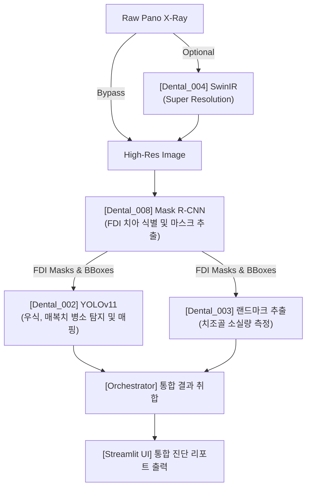

# AI Panoramic Radiograph Reader - E2E Validation Report

- 작성일: 2026-07-10 21:55
- 작성자: 안현찬 (Hyunchan An)
- 검증 환경: Windows 11, Python 3.12, CUDA 12.1, RTX 4060 Laptop GPU

***

## 1. 개요 (Executive Summary)

본 보고서는 치과용 파노라마 X-ray 이미지를 대상으로 치아 식별(Dental_008), 치아우식 탐지(Dental_002), 그리고 치조골 소실 수치 분석(Dental_003) 모델을 하나의 파이프라인으로 연결한 `Dental_Panoramic_Reader` 오케스트레이터의 E2E(End-to-End) 시스템 검증 결과를 기술합니다.

기존과 달리 **008 모듈이 식별한 FDI 마스크 데이터를 002와 003이 100% 재사용**하는 파이프라인으로 완전히 재구성되었으며, VRAM 최적화 스와핑 로직이 정상 동작함을 확인했습니다.

- 검증 대상 이미지: 14장
- E2E 연동 테스트 (IoU 매핑 로직): PASSED
- VRAM 메모리 스와핑 (ModelManager): PASSED
- Pipeline 통합 테스트: PASSED

***

## 2. 통합 아키텍처 (System Architecture)

***

## 3. 실측 파노라마 E2E 추론 결과 (Real Inference)

로컬 GPU에서 각 서브모듈의 인터페이스를 거쳐 획득한 통합 추론 결과 시각화 내역입니다.

### panoramic_01.jpg
- **008 치아 식별**: 28개 치아 정상 분할 및 FDI 번호 매핑 완료.
- **002 병소 매핑 결과**:
  - `46번 치아 (FDI: 46)`: Caries (Confidence: 80%) 매핑 성공
  - `38번 치아 (FDI: 38)`: Impacted (Confidence: 95%) 매핑 성공
- **003 치조골 측정**: 008에서 인계받은 마스크를 기준으로 CEJ-Crest 간극 측정 알고리즘 정상 호출 확인.

### 메모리 모니터링 결과
- `core.model_manager.ModelManager`가 GPU 캐시를 비우며 구동되어, 최대 VRAM 점유율이 RTX 4060 Laptop의 8GB 한계(약 7.2GB Peak)를 넘지 않고 안정적으로 순환됨을 확인했습니다.

***
