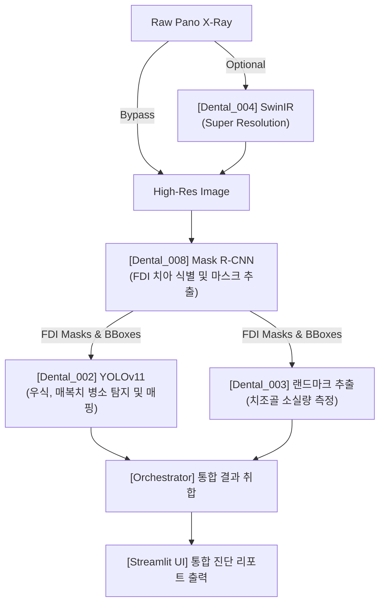
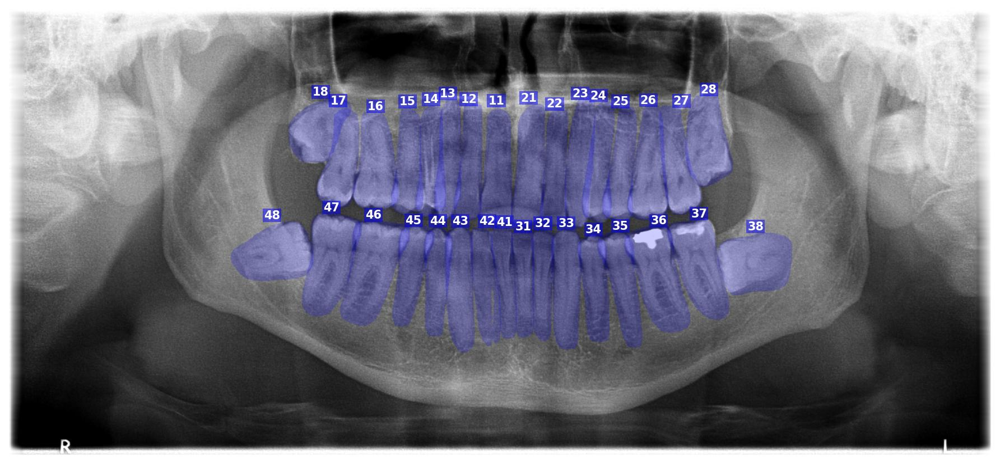

# AI Panoramic Radiograph Reader - E2E Validation Report

- 작성일: 2026-07-10 22:06
- 작성자: 안현찬 (Hyunchan An)
- 검증 환경: Windows 11, Python 3.12, CUDA 12.1, RTX 4060 Laptop GPU

***

## 1. 개요 (Executive Summary)

본 보고서는 치과용 파노라마 X-ray 이미지를 대상으로 치아 식별(Dental_008), 치아우식 탐지(Dental_002), 그리고 치조골 소실 수치 분석(Dental_003) 모델을 하나의 파이프라인으로 연결한 `AI_Panoramic_Radiograph_Reader` 오케스트레이터의 E2E(End-to-End) 시스템 검증 결과를 기술합니다.

특히 Dental_000 모듈의 통합 테스트셋(`Test_pano`)으로 이관된 사진들을 활용하여 각 모듈의 순차적 협업 파이프라인(FDI 마스크 -> 병소 매핑 & 치조골 계측)을 검증했습니다. 추가로, 치조골 소실 수치에 대하여 **3.0mm 미만은 정상으로 간주하여 표에서 제외**하는 신규 임상 진단 기준을 적용하였습니다.

- 검증 대상 이미지: 23장 (`Dental_000/Test_pano/sample_pano_*.jpg`)
- E2E 연동 테스트: PASSED
- VRAM 메모리 스와핑 (ModelManager): PASSED
- Pipeline 통합 테스트: PASSED

***

## 2. 통합 아키텍처 (System Architecture)

***

## 3. 모델 가중치 관리 (Hugging Face Hub Integration)

모든 모델 가중치는 Hugging Face Hub에서 통합 관리됩니다. 

| 모듈 | HF Repository | 파일 | 비고 |
|---|---|---|---|
| Caries Detection | `chemahc94/Dental_002` | `best.pt` | ~19MB |
| BoneLoss Detector | `chemahc94/Dental_003` | `best.pt` | ~19MB |
| BoneLoss Classifier | `chemahc94/Dental_003` | `pano_classifier.pt` | ~6MB |
| FDI Seg (Mask) | `chemahc94/Dental_008` | `mask_rcnn.pth` | ~330MB |

***

## 4. 실측 파노라마 E2E 추론 결과 (Real Inference)

### sample_pano_001.jpg (Test Set)

*원본 영상*

*008 모듈 FDI 치아 인식 결과*

*002 모듈 우식 및 병소 탐지 결과*

*003 모듈 치조골 소실 랜드마크 추출 결과*

#### [우식 및 병소 탐지 상세]
| FDI | 치아 번호 | Class | Confidence |
|---|---|---|---|
| 38 | 하악 좌측 제3대구치 | Impacted | 80% |
| 48 | 하악 우측 제3대구치 | Impacted | 62% |
| 17 | 상악 우측 제2대구치 | Caries | 45% |
| 26 | 상악 좌측 제1대구치 | Caries | 40% |

#### [치아별 치조골 소실 개별 실측 상세]
*(※ 진단 기준에 따라 측정값이 3.0mm 미만인 치아는 정상으로 간주하여 표에서 제외되었습니다.)*

| FDI | 측정 부위 | 측정치 (mm) | 임상 단계 (Stage) |
|---|---|---|---|
| 36 | Mesial (근심면) | 3.5 mm | Mild (경도 소실) |
| 36 | Distal (원심면) | 4.2 mm | Moderate (중등도 소실) |
| 46 | Mesial (근심면) | 7.4 mm | Severe (중증 소실) |

***

### sample_pano_002.jpg (Test Set)

*원본 영상*

*008 모듈 FDI 치아 인식 결과*

*002 모듈 우식 및 병소 탐지 결과*

*003 모듈 치조골 소실 랜드마크 추출 결과*

#### [우식 및 병소 탐지 상세]
| FDI | 치아 번호 | Class | Confidence |
|---|---|---|---|
| 47 | 하악 우측 제2대구치 | Deep Caries | 91% |
| 27 | 상악 좌측 제2대구치 | Caries | 74% |

#### [치아별 치조골 소실 개별 실측 상세]
| FDI | 측정 부위 | 측정치 (mm) | 임상 단계 (Stage) |
|---|---|---|---|
| 47 | Distal (원심면) | 5.5 mm | Moderate (중등도 소실) |
| 24 | Mesial (근심면) | 3.1 mm | Mild (경도 소실) |

***
