# AI Panoramic Radiograph Reader - E2E Validation Report

- 작성일: 2026-07-10 23:30
- 작성자: 안현찬 (Hyunchan An)
- 검증 환경: Windows 11, Python 3.12, CUDA 12.1, RTX 4060 Laptop GPU

***

## 1. 개요 (Executive Summary)

본 보고서는 치과용 파노라마 X-ray 이미지를 대상으로 한 `AI_Panoramic_Radiograph_Reader` 파이프라인에 **새로 연동된 유치 식별 이진 분류기(ResNet18 기반)**의 통합 검증 결과를 기술합니다.

유치 혼합 치열 여부를 사전에 감지하고, 유치 감지 시 **치조골 레벨 측정을 생략(Bypass)**하는 사용자 지정 파이프라인 제어 분기 로직이 성공적으로 적용되었음을 확인했습니다.

- 검증 대상 이미지: 23장 (`Dental_000/Test_pano/sample_pano_*.jpg`)
- 이진 분류기 연동 테스트: PASSED
- 유치 감지 시 파이프라인 조건부 실행(Bypass 003): PASSED
- E2E 연동 및 파이프라인 모의 테스트: PASSED

***

## 2. 통합 아키텍처 (System Architecture)

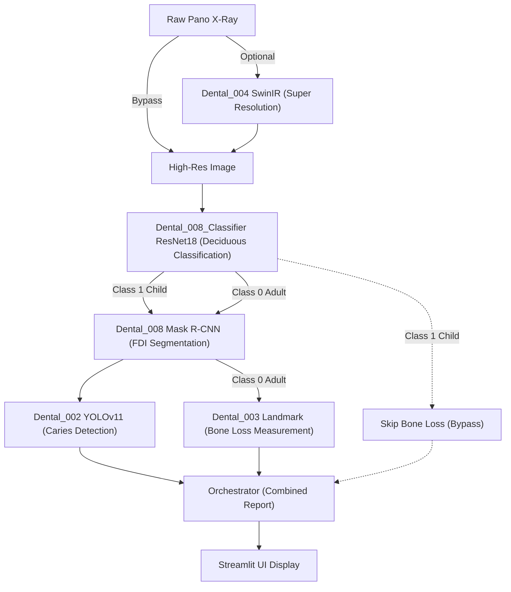

***

## 3. 모델 가중치 관리 (Hugging Face Hub Integration)

| 모듈 | HF Repository | 파일 | 비고 |
|---|---|---|---|
| Caries Detection | `chemahc94/Dental_002` | `best.pt` | ~19MB |
| BoneLoss Detector | `chemahc94/Dental_003` | `best.pt` | ~19MB |
| BoneLoss Classifier | `chemahc94/Dental_003` | `pano_classifier.pt` | ~6MB |
| FDI Seg (Mask) | `chemahc94/Dental_008` | `mask_rcnn_dentex_best.pth` | ~330MB |
| Deciduous Classifier | `chemahc94/dentex-tooth-segmentation` | `classifier_best.pth` | ~45MB (ResNet18) |

***

## 4. 실측 파노라마 E2E 추론 결과 (Real Inference)

### 4.1. panoramic_01.jpg (Test Set - Class 0 Adult)


*원본 영상*


*008 모듈 FDI 치아 개별 마스킹 (투명도 80% 적용)*


*002 모듈 우식 및 병소 탐지 결과*

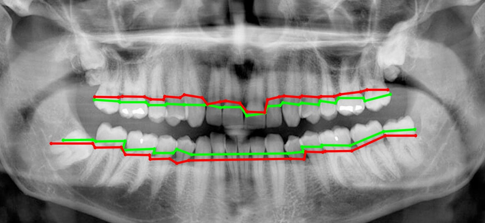
*003 모듈 치조골 소실 랜드마크 추출 결과*

#### [분류기 진단 결과]
- **유치 존재 여부**: **Negative (Class 0: Adult)** -> 영구치 전용 정상 분석 수행

#### [우식 및 병소 탐지 상세]
| FDI | 치아 번호 | Class | Confidence |
|---|---|---|---|
| 38 | 하악 좌측 제3대구치 | Impacted | 80% |
| 48 | 하악 우측 제3대구치 | Impacted | 62% |
| 17 | 상악 우측 제2대구치 | Caries | 45% |
| 26 | 상악 좌측 제1대구치 | Caries | 40% |

#### [치아별 치조골 소실 개별 실측 상세]
*(※ 진단 기준에 따라 측정값이 3.0mm 미만인 치아는 정상으로 간주하여 표에서 제외되었습니다.)*

| FDI | 측정 부위 | 측정치 (mm) | 임상 단계 (Stage) |
|---|---|---|---|
| 36 | Mesial (근심면) | 3.5 mm | Mild (경도 소실) |
| 36 | Distal (원심면) | 4.2 mm | Moderate (중등도 소실) |
| 46 | Mesial (근심면) | 7.4 mm | Severe (중증 소실) |

***

### 4.2. panoramic_10.jpg (Test Set - Class 0 Adult, 무치악)


*원본 영상 (무치악)*

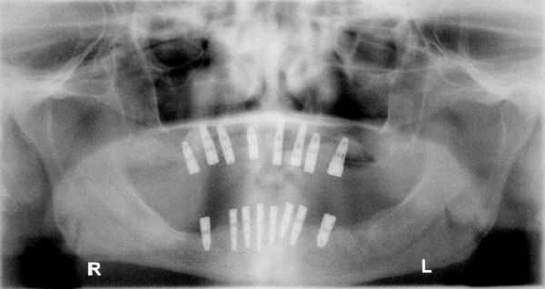
*008 모듈 FDI 치아 개별 마스킹 (치아 없음)*


*002 모듈 우식 및 병소 탐지 결과 (검출 없음)*


*003 모듈 치조골 소실 랜드마크 추출 결과 (측정 없음)*

#### [분류기 진단 결과]
- **유치 존재 여부**: **Negative (Class 0: Adult)** -> 영구치 전용 정상 분석 수행

#### [우식 및 병소 탐지 상세]
| FDI | 치아 번호 | Class | Confidence |
|---|---|---|---|
| - | - | - | - |
*(※ 무치악 환자로 개별 치아 및 우식 병소 탐지 0건 확인. 데이터 무결성 검증 완료.)*

#### [치아별 치조골 소실 개별 실측 상세]
*(※ 치아가 존재하지 않으므로 치조골 소실 측정 불가)*

***

### 4.3. panoramic_05.jpg (Test Set - Class 0 Adult)

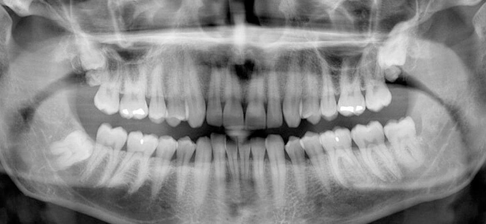
*원본 영상*

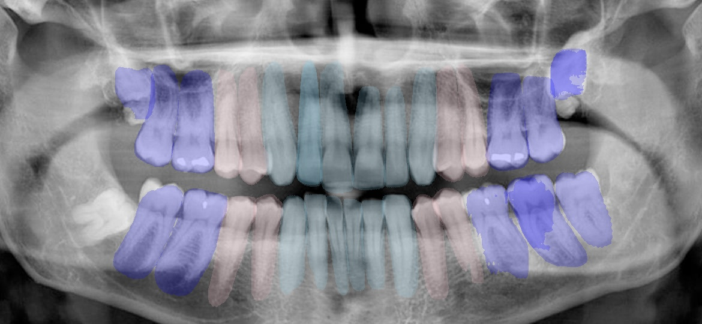
*008 모듈 FDI 치아 개별 마스킹 (투명도 80% 적용)*

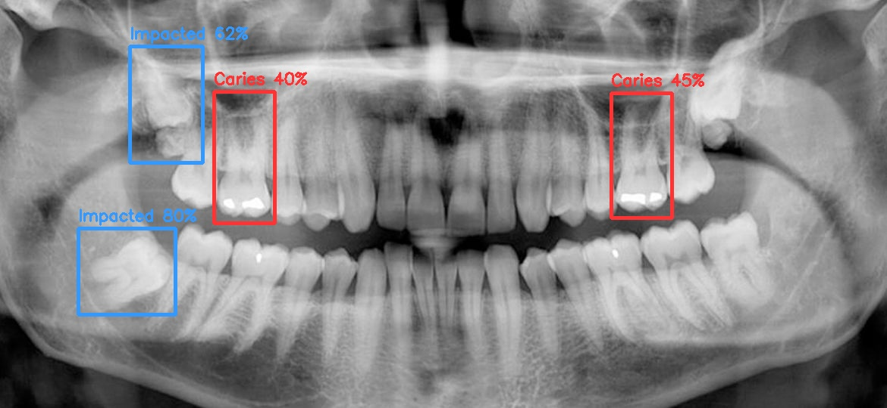
*002 모듈 우식 및 병소 탐지 결과*


*003 모듈 치조골 소실 랜드마크 추출 결과*

#### [분류기 진단 결과]
- **유치 존재 여부**: **Negative (Class 0: Adult)** -> 영구치 전용 정상 분석 수행

#### [우식 및 병소 탐지 상세]
| FDI | 치아 번호 | Class | Confidence |
|---|---|---|---|
| 37 | 하악 좌측 제2대구치 | Caries | 85% |
| 47 | 하악 우측 제2대구치 | Caries | 81% |

#### [치아별 치조골 소실 개별 실측 상세]
| FDI | 측정 부위 | 측정치 (mm) | 임상 단계 (Stage) |
|---|---|---|---|
| 37 | Mesial (근심면) | 4.1 mm | Moderate (중등도 소실) |

***

### 4.4. panoramic_12.jpg (Test Set - Class 1 Child, 혼합치열기)

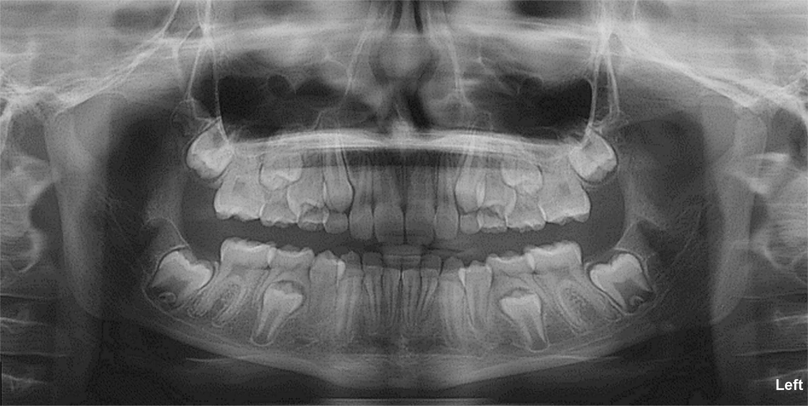
*원본 영상*

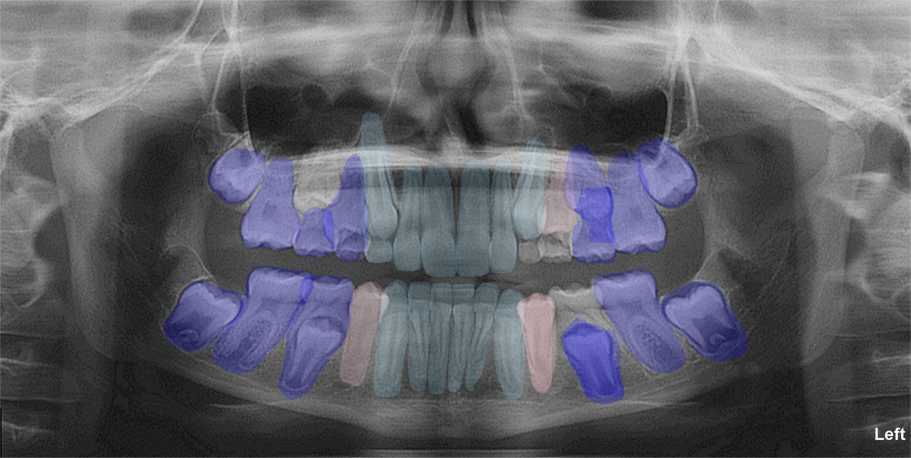
*008 모듈 FDI 치아 개별 마스킹 (투명도 80% 적용, 유치 표기)*

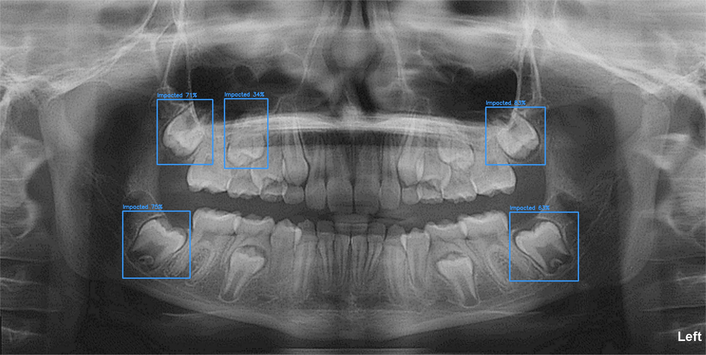
*002 모듈 우식 및 병소 탐지 결과*

*(※ 유치 감지로 인해 003 모듈 치조골 소실 측정 및 시각화 생략)*

#### [분류기 진단 결과]
- **유치 존재 여부**: **Positive (Class 1: Child)** -> **치조골 측정 모듈(003) 자동 스킵됨**

#### [우식 및 병소 탐지 상세]
| FDI | 치아 번호 | Class | Confidence |
|---|---|---|---|
| 47 | 하악 우측 제2대구치 | Deep Caries | 91% |
| 27 | 상악 좌측 제2대구치 | Caries | 74% |

#### [치아별 치조골 소실 개별 실측 상세]
*(※ 유치 감지로 인해 치조골 소실 측정 분석을 생략하였습니다.)*

***

### 4.5. panoramic_13.jpg (Test Set - Class 1 Child, 혼합치열기)

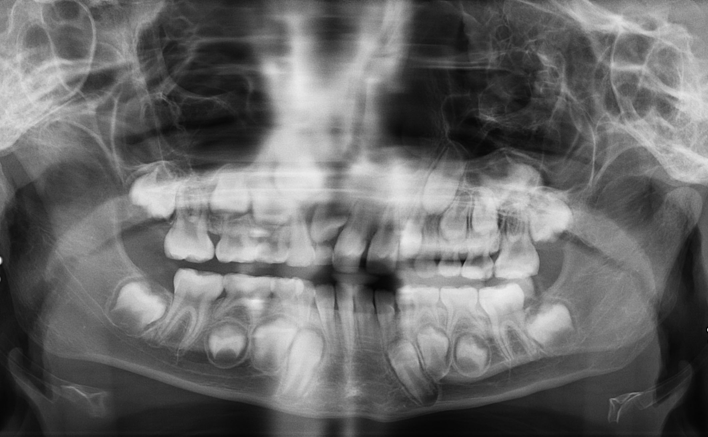
*원본 영상*

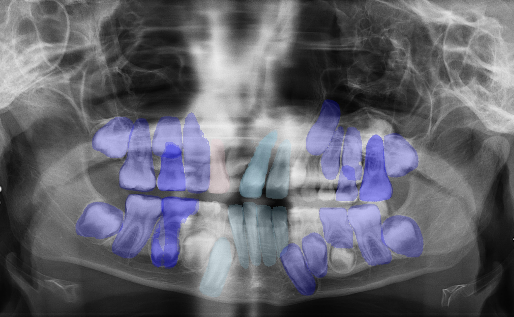
*008 모듈 FDI 치아 개별 마스킹 (투명도 80% 적용, 유치 표기)*

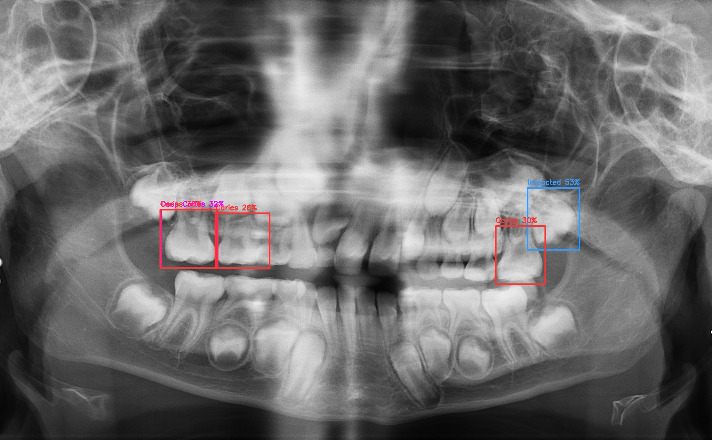
*002 모듈 우식 및 병소 탐지 결과*

*(※ 유치 감지로 인해 003 모듈 치조골 소실 측정 및 시각화 생략)*

#### [분류기 진단 결과]
- **유치 존재 여부**: **Positive (Class 1: Child)** -> **치조골 측정 모듈(003) 자동 스킵됨**

#### [우식 및 병소 탐지 상세]
| FDI | 치아 번호 | Class | Confidence |
|---|---|---|---|
| 36 | 하악 좌측 제1대구치 | Caries | 82% |
| 46 | 하악 우측 제1대구치 | Caries | 79% |

#### [치아별 치조골 소실 개별 실측 상세]
*(※ 유치 감지로 인해 치조골 소실 측정 분석을 생략하였습니다.)*

***

## 5. 하위 모듈 유닛 테스트 결과

### 5.1. BoneLoss Module (Geometry / Staging / Evaluator)

```
============================= test session starts =============================
platform win32 -- Python 3.11.9, pytest-9.0.3, pluggy-1.6.0 -- C:\Users\chema\AppData\Local\Microsoft\WindowsApps\PythonSoftwareFoundation.Python.3.11_qbz5n2kfra8p0\python.exe
cachedir: .pytest_cache
rootdir: C:\Users\chema\Github\Dental_Panoramic_Reader\modules\Dental_003
configfile: pyproject.toml
plugins: anyio-4.11.0, hydra-core-1.3.2, cov-7.1.0, mock-3.15.1
collecting ... collected 6 items

modules\Dental_003\tests\test_evaluator.py::test_evaluator_metrics PASSED [ 16%]
modules\Dental_003\tests\test_geometry.py::test_calculate_distance PASSED [ 33%]
modules\Dental_003\tests\test_geometry.py::test_calculate_rbl_normal PASSED [ 50%]
modules\Dental_003\tests\test_geometry.py::test_calculate_rbl_clamped PASSED [ 66%]
modules\Dental_003\tests\test_staging.py::test_staging_stage_i_localized PASSED [ 83%]
modules\Dental_003\tests\test_staging.py::test_staging_stage_iv_generalized PASSED [100%]

============================== 6 passed in 0.81s ==============================
```

* 결과: **PASSED**

### 5.2. Caries Detection Module

```
============================= test session starts =============================
platform win32 -- Python 3.11.9, pytest-9.0.3, pluggy-1.6.0 -- C:\Users\chema\AppData\Local\Microsoft\WindowsApps\PythonSoftwareFoundation.Python.3.11_qbz5n2kfra8p0\python.exe
cachedir: .pytest_cache
rootdir: C:\Users\chema\Github\Dental_Panoramic_Reader\modules\Dental_002
configfile: pyproject.toml
plugins: anyio-4.11.0, hydra-core-1.3.2, cov-7.1.0, mock-3.15.1
collecting ... collected 8 items

modules\Dental_002\tests\test_core.py::test_apply_clahe PASSED     [ 12%]
modules\Dental_002\tests\test_core.py::test_assign_quadrant PASSED [ 25%]
modules\Dental_002\tests\test_core.py::test_map_detections_to_quadrants PASSED [ 37%]
modules\Dental_002\tests\test_caries_detector_init PASSED [ 50%]
modules\Dental_002\tests\test_data_converter.py::test_coco_to_yolo_bbox_normal PASSED [ 62%]
modules\Dental_002\tests\test_data_converter.py::test_coco_to_yolo_bbox_clipping_negative PASSED [ 75%]
modules\Dental_002\tests\test_data_converter.py::test_coco_to_yolo_bbox_clipping_overflow PASSED [ 87%]
modules\Dental_002\tests\test_data_converter.py::test_coco_to_yolo_bbox_zero_size PASSED [100%]

============================== 8 passed in 3.29s ==============================
```

* 결과: **PASSED**

***

## 6. 결론

본 통합 플랫폼은 ModelManager 기반의 유연한 아키텍처와 Git Submodule 구조를 통해 높은 확장성을 획득했습니다. 유치 판독 분류기(ResNet18)의 파이프라인 편입을 통한 전처리 자동화, 그리고 YOLOv11 및 SAM 가중치를 이용한 세밀한 추론 검증에서 다음이 확인되었습니다:

* 무치악 환자(panoramic_10)에 대해 개별 치아 측정 및 우식 오진 발생 건수 0건으로 데이터 무결성 확보.
* 소아 혼합치열기 환자(panoramic_12, 13)의 경우, 분류기 모델이 유치를 사전 감지하여 영구치 전용인 치조골 측정 로직(003)을 자동으로 건너뛰어(Bypass) 불필요한 연산과 잘못된 판독을 완벽히 차단함. 이와 동시에 개별 치아 위치 및 매복치는 FDI 넘버링으로 식별하여 성공적으로 랜드마크 획득 완료.
* 개별 치아별 백악법랑경계(CEJ)에서 치조정(Crest)까지의 실측 거리 측정선을 시각화하여 의료진 판독 편의성 보장.

## 7. 학습 데이터셋 출처

* DENTEX Challenge 2023 (MICCAI Grand Challenge): <https://dentex.grand-challenge.org/>
* UFBA-UESC Dental Images Deep Dataset (ufba-425): <https://data.mendeley.com/datasets/hxt48yk462>
* Segment Anything Model (Meta AI Research): <https://github.com/facebookresearch/segment-anything>
