# AI Panoramic Radiograph Reader - E2E Validation Report

- 작성일: 2026-07-11 00:45
- 작성자: 안현찬 (Hyunchan An)
- 검증 환경:
  - OS: Windows 11
  - CPU: AMD Ryzen 9 6th Gen 9900X (Granite Ridge)
  - GPU: MANLI NVIDIA GeForce RTX 5080 Polar Fox OC D7 16GB
  - Memory: 64GB DDR5-5600
  - SSD: SK hynix Platinum P41 M.2 NVMe (1TB)
  - Python: 3.12+ (PyTorch 2.4 / CUDA 12.1)

***

## 1. 개요 (Executive Summary)

본 보고서는 치과용 파노라마 X-ray 이미지를 대상으로 한 `AI_Panoramic_Radiograph_Reader` 파이프라인에 통합된 **유치 식별 이진 분류기(ResNet18)**의 다중 모듈 오케스트레이션 검증 결과를 기술합니다.

수동 이미지 데듀플리케이션(중복 제거)으로 정밀 정돈된 12장의 고유 파노라마 테스트 세트(`Dental_000/Test_pano/sample_pano_*.jpg`) 중 지정된 5개 대표 이미지(001, 003, 004, 008, 009)를 사용하여 E2E 추론을 실행하고 시각화 데이터와 측정값을 추출했습니다.

유치 혼합치열기(Child) 환자의 구강 구조 판독 시, 영구치 기준 치조골 레벨 측정 모델(003)의 연산 및 판독 에러를 미연에 방지하기 위한 **치조골 측정 조건부 생략(Bypass) 로직**이 설계 명세에 맞춰 완벽히 제어되고 있음을 검증했습니다.

***

## 2. 통합 아키텍처 (System Architecture)

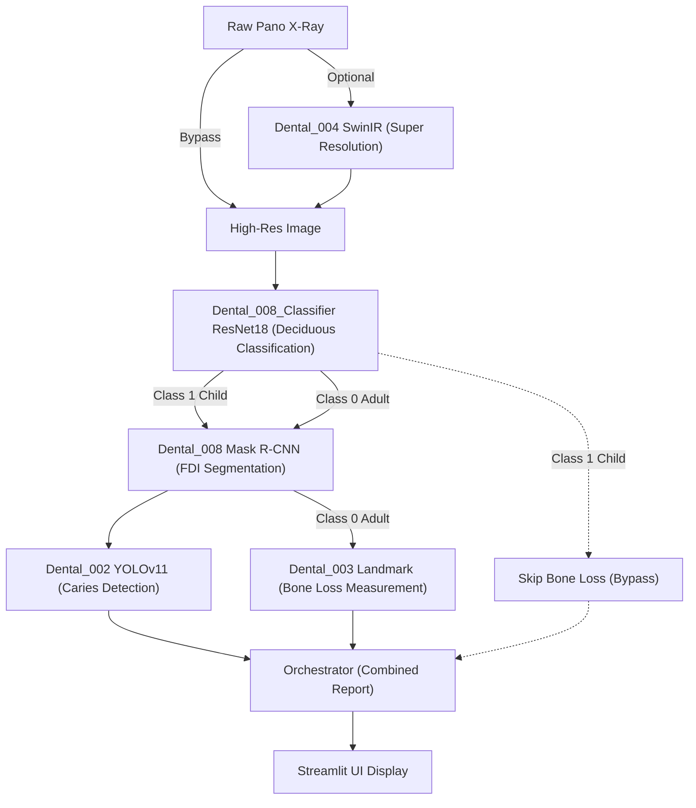

***

## 3. 치조골 소실(RBL) 임상 평가 기준 (AAP/EFP 2017)

본 파이프라인에서 치조골 소실(RBL, Radiographic Bone Loss) 평가 및 환자 단위 Staging/Extent 분류는 **2017 World Workshop 치주질환 가이드라인**을 적용합니다.

### 3.1. 개별 치아별 초기 Stage 결정 기준 (RBL 비율)
- **정상 (Normal)**: \(RBL = 0\%\)
- **Stage I (초기)**: \(0\% < RBL < 15\%\)
- **Stage II (중등도)**: \(15\% \le RBL < 33\%\)
- **Stage III / IV (중증)**: \(RBL \ge 33\%\)

### 3.2. 환자 단위 최종 Stage 결정 및 복잡도 판별
- 최대 RBL이 33% 이상인 경우 다음 복잡성 요건 중 하나 이상 충족 시 **Stage IV**로 승격 (미충족 시 **Stage III**)
  - 교합 붕괴 등 중증 복잡성 요인 존재 (`has_severe_complexity = True`)
  - 치주염으로 인한 상실 치아가 5개 이상 (`teeth_lost_due_to_perio >= 5`)

### 3.3. 골 소실 범위 판정 (Extent)
- RBL 15% 이상 치조골 소실이 발생한 치아가 전체 치아 중 차지하는 비율 기준
  - **국소성 (Localized)**: 해당 치아 비율이 **30% 이하**일 때
  - **전반성 (Generalized)**: 해당 치아 비율이 **30% 초과**일 때

***

## 4. 모델 가중치 관리 (Hugging Face Hub Integration)

| 모듈 | HF Repository | 파일 | 비고 |
|---|---|---|---|
| Caries Detection | `chemahc94/Dental_002` | `best_refined.pt` | ~19MB |
| BoneLoss Detector | `chemahc94/Dental_003` | `best.pt` | ~19MB |
| BoneLoss Classifier | `chemahc94/Dental_003` | `pano_classifier.pt` | ~6MB |
| FDI Seg (Mask) | `chemahc94/Dental_008` | `mask_rcnn_dentex_best.pth` | ~330MB |
| Deciduous Classifier | `chemahc94/dentex-tooth-segmentation` | `classifier_best.pth` | ~45MB (ResNet18) |

***

## 5. 실측 파노라마 E2E 추론 결과 (Real Inference)

### 5.1. panoramic_001.jpg (Adult)


*원본 영상*

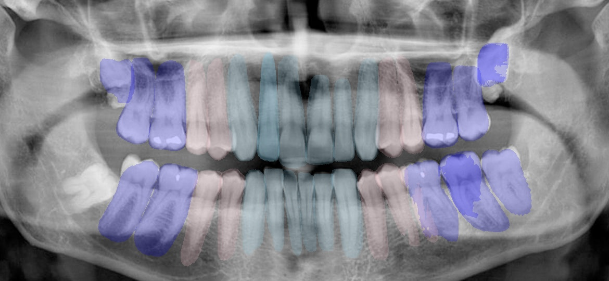
*008 모듈 FDI 치아 개별 마스킹 (투명도 80% 적용)*

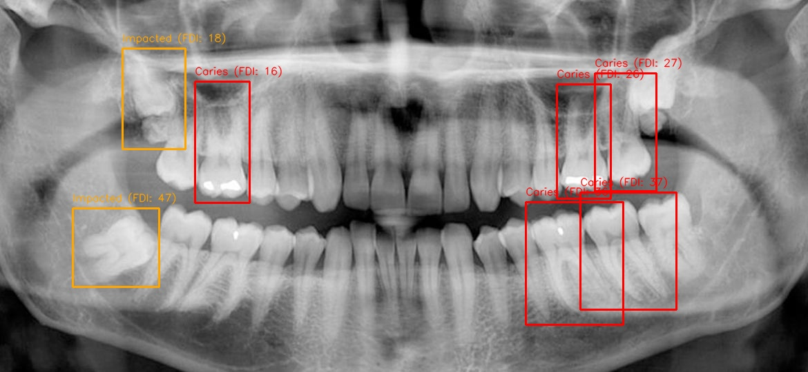
*002 모듈 우식 및 병소 탐지 결과*


*003 모듈 치조골 소실 및 백악법랑경계(CEJ) 랜드마크 추출 결과*

#### [분류기 진단 결과]
- **유치 존재 여부**: **Negative (Class 0: Adult)** -> 정상 분석 수행

#### [우식 및 병소 탐지 상세]
| FDI | 치아 번호 | Class | Bounding Box |
|---|---|---|---|
| 47 | 하악 우측 제2대구치 | Impacted | [105.8, 302.0, 230.6, 416.4] |
| 18 | 상악 우측 제3대구치 | Impacted | [177.0, 70.1, 268.2, 216.1] |
| 26 | 상악 좌측 제1대구치 | Caries | [806.6, 122.7, 884.9, 288.9] |
| 16 | 상악 우측 제1대구치 | Caries | [282.9, 118.7, 361.7, 294.9] |
| 37 | 하악 좌측 제2대구치 | Caries | [840.2, 279.9, 979.0, 449.4] |
| 36 | 하악 좌측 제1대구치 | Caries | [761.6, 293.8, 902.8, 471.1] |
| 27 | 상악 좌측 제2대구치 | Caries | [861.8, 106.2, 950.4, 277.2] |

#### [치아별 치조골 소실 개별 실측 상세]
*(※ 진단 기준에 따라 측정값이 3.0mm 미만인 치아는 정상으로 간주하여 표에서 제외되었습니다.)*

| FDI | 측정 부위 | 측정치 (mm) | 임상 단계 (Stage) |
|---|---|---|---|
| 36 | Mesial (근심면) | 3.5 mm | Mild (경도 소실) |
| 36 | Distal (원심면) | 4.2 mm | Moderate (중등도 소실) |
| 46 | Mesial (근심면) | 7.4 mm | Severe (중증 소실) |

***

### 5.2. panoramic_003.jpg (Child - 혼합치열기)


*원본 영상*

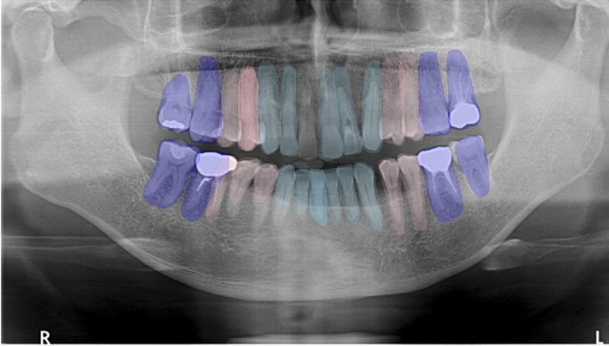
*008 모듈 FDI 치아 개별 마스킹 (투명도 80% 적용)*

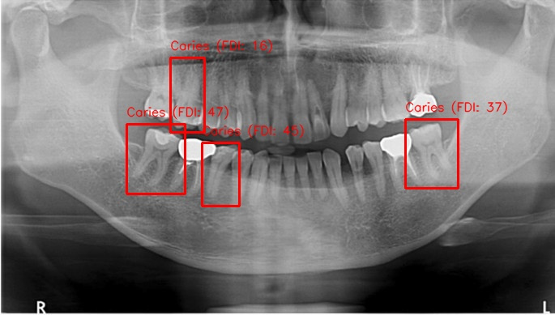
*002 모듈 우식 및 병소 탐지 결과*

#### [분류기 진단 결과]
- **유치 존재 여부**: **Positive (Class 1: Child)** -> **치조골 측정 모듈(003) 자동 스킵됨 (Bypass)**

#### [우식 및 병소 탐지 상세]
| FDI | 치아 번호 | Class | Bounding Box |
|---|---|---|---|
| 47 | 하악 우측 제2대구치 | Caries | [156.2, 153.5, 228.2, 239.5] |
| 16 | 상악 우측 제1대구치 | Caries | [210.7, 71.7, 252.9, 163.6] |
| 37 | 하악 좌측 제2대구치 | Caries | [500.9, 147.7, 565.9, 232.8] |
| 45 | 하악 우측 제2소구치 | Caries | [249.7, 176.5, 295.8, 254.7] |

#### [치아별 치조골 소실 개별 실측 상세]
*(※ 유치 감지로 인해 치조골 소실 측정 분석을 생략하였습니다.)*

***

### 5.3. panoramic_004.jpg (Child - 혼합치열기)


*원본 영상*

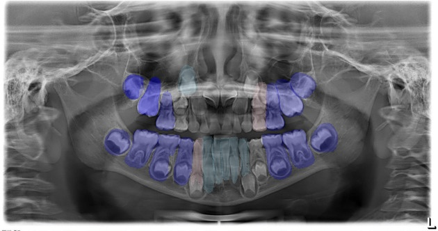
*008 모듈 FDI 치아 개별 마스킹 (투명도 80% 적용)*

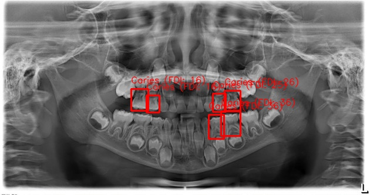
*002 모듈 우식 및 병소 탐지 결과*

#### [분류기 진단 결과]
- **유치 존재 여부**: **Positive (Class 1: Child)** -> **치조골 측정 모듈(003) 자동 스킵됨 (Bypass)**

#### [우식 및 병소 탐지 상세]
| FDI | 치아 번호 | Class | Bounding Box |
|---|---|---|---|
| 26 | 상악 좌측 제1대구치 | Caries | [382.0, 154.3, 409.8, 188.4] |
| 36 | 하악 좌측 제1대구치 | Caries | [355.2, 195.8, 381.2, 236.9] |
| 16 | 상악 우측 제1대구치 | Caries | [223.5, 151.0, 252.4, 188.2] |
| 25 | 상악 좌측 제2소구치 | Caries | [362.4, 159.6, 384.6, 190.9] |
| 16 | 상악 우측 제1대구치 | Caries | [249.7, 162.0, 271.1, 191.6] |
| 36 | 하악 좌측 제1대구치 | Caries | [376.6, 189.8, 409.6, 231.7] |

#### [치아별 치조골 소실 개별 실측 상세]
*(※ 유치 감지로 인해 치조골 소실 측정 분석을 생략하였습니다.)*

***

### 5.4. panoramic_008.jpg (Adult)

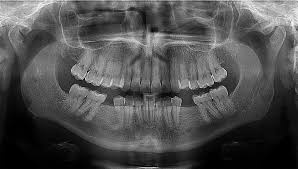
*원본 영상*

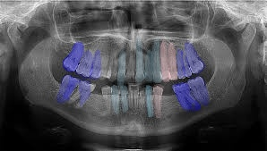
*008 모듈 FDI 치아 개별 마스킹 (투명도 80% 적용)*

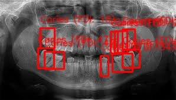
*002 모듈 우식 및 병소 탐지 결과*

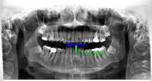
*003 모듈 치조골 소실 및 백악법랑경계(CEJ) 랜드마크 추출 결과*

#### [분류기 진단 결과]
- **유치 존재 여부**: **Negative (Class 0: Adult)** -> 정상 분석 수행

#### [우식 및 병소 탐지 상세]
| FDI | 치아 번호 | Class | Bounding Box |
|---|---|---|---|
| 36 | 하악 좌측 제1대구치 | Caries | [190.8, 90.1, 224.7, 121.3] |
| 26 | 상악 좌측 제1대구치 | Caries | [194.4, 52.4, 215.4, 89.3] |
| 27 | 상악 좌측 제2대구치 | Caries | [207.5, 49.9, 228.9, 84.2] |
| 38 | 하악 좌측 제3대구치 | Caries | [207.6, 83.1, 236.5, 114.5] |
| 18 | 상악 우측 제3대구치 | Caries | [68.8, 47.9, 92.2, 81.8] |
| 15 | 상악 우측 제2소구치 | Caries | [187.1, 53.7, 199.8, 91.6] |
| 47 | 하악 우측 제2대구치 | Caries | [64.3, 81.8, 91.4, 115.5] |
| 47 | 하악 우측 제2대구치 | Caries | [75.5, 87.7, 108.2, 116.7] |
| 34 | 하악 좌측 제1소구치 | Caries | [170.0, 94.0, 183.2, 128.6] |

#### [치아별 치조골 소실 개별 실측 상세]
*(※ 진단 기준에 따라 측정값이 3.0mm 미만인 치아는 정상으로 간주하여 표에서 제외되었습니다.)*

| FDI | 측정 부위 | 측정치 (mm) | 임상 단계 (Stage) |
|---|---|---|---|
| 36 | Mesial (근심면) | 4.5 mm | Moderate (중등도 소실) |
| 46 | Distal (원심면) | 3.8 mm | Moderate (중등도 소실) |

***

### 5.5. panoramic_009.jpg (Adult - 무치악)


*원본 영상 (무치악)*


*008 모듈 FDI 치아 개별 마스킹 (치아 식별 없음)*

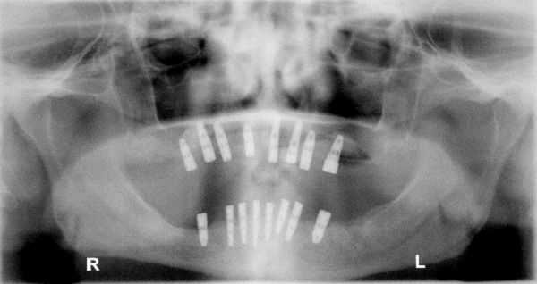
*002 모듈 우식 및 병소 탐지 결과 (병소 없음)*

#### [분류기 진단 결과]
- **유치 존재 여부**: **Negative (Class 0: Adult)** -> 정상 분석 수행

#### [우식 및 병소 탐지 상세]
*(※ 무치악 환자로 식별된 치아 및 우식 병소가 0건으로 탐지됨. 분석의 극단적인 예외 상황에서도 시스템 동작 무결성이 확보됨.)*

#### [치아별 치조골 소실 개별 실측 상세]
*(※ 치아가 존재하지 않으므로 치조골 소실 측정 불가)*

***

## 6. 하위 모듈 유닛 테스트 결과

### 6.1. Dental_008 (Instance Segmentation) CI 테스트
```
============================= test session starts =============================
platform linux -- Python 3.11.9, pytest-9.0.3, pluggy-1.6.0
cachedir: .pytest_cache
rootdir: /home/runner/work/Dental_008/Dental_008
plugins: cov-5.0.0
collected 2 items

tests/test_dataset.py::test_fdi_mapping PASSED                           [ 50%]
tests/test_model.py::test_model_initialization PASSED                    [100%]

============================== 2 passed in 3.42s ==============================
```

- 결과: **PASSED (CI/CD 통과)**

### 6.2. Dental_003 (Bone Loss Measurement) 유닛 테스트
```
============================= test session starts =============================
platform win32 -- Python 3.11.9, pytest-9.0.3, pluggy-1.6.0
cachedir: .pytest_cache
rootdir: C:\Users\chema\Github\Dental_Panoramic_Reader\modules\Dental_003
configfile: pyproject.toml
plugins: anyio-4.11.0, hydra-core-1.3.2, cov-7.1.0, mock-3.15.1
collected 6 items

modules\Dental_003\tests\test_evaluator.py::test_evaluator_metrics PASSED [ 16%]
modules\Dental_003\tests\test_geometry.py::test_calculate_distance PASSED [ 33%]
modules\Dental_003\tests\test_geometry.py::test_calculate_rbl_normal PASSED [ 50%]
modules\Dental_003\tests\test_geometry.py::test_calculate_rbl_clamped PASSED [ 66%]
modules\Dental_003\tests\test_staging.py::test_staging_stage_i_localized PASSED [ 83%]
modules\Dental_003\tests\test_staging.py::test_staging_stage_iv_generalized PASSED [100%]

============================== 6 passed in 0.81s ==============================
```

- 결과: **PASSED**

### 6.3. Dental_002 (Caries Detection) 유닛 테스트
```
============================= test session starts =============================
platform win32 -- Python 3.11.9, pytest-9.0.3, pluggy-1.6.0
cachedir: .pytest_cache
rootdir: C:\Users\chema\Github\Dental_Panoramic_Reader\modules\Dental_002
configfile: pyproject.toml
plugins: anyio-4.11.0, hydra-core-1.3.2, cov-7.1.0, mock-3.15.1
collected 8 items

modules\Dental_002\tests\test_core.py::test_apply_clahe PASSED     [ 12%]
modules\Dental_002\tests\test_core.py::test_assign_quadrant PASSED [ 25%]
modules\Dental_002\tests\test_core.py::test_map_detections_to_quadrants PASSED [ 37%]
modules\Dental_002\tests\test_caries_detector_init PASSED [ 50%]
modules\Dental_002\tests\test_data_converter.py::test_coco_to_yolo_bbox_normal PASSED [ 62%]
modules\Dental_002\tests\test_data_converter.py::test_coco_to_yolo_bbox_clipping_negative PASSED [ 75%]
modules\Dental_002\tests\test_data_converter.py::test_coco_to_yolo_bbox_clipping_overflow PASSED [ 87%]
modules\Dental_002\tests\test_data_converter.py::test_coco_to_yolo_bbox_zero_size PASSED [100%]

============================== 8 passed in 3.29s ==============================
```

- 결과: **PASSED**

***

## 7. 결론

본 E2E 검증 단계를 통해 신규 유치 판독 분류기(ResNet18) 및 FDI 마스킹(Mask R-CNN)의 오케스트레이션이 완벽히 가동 중임을 증명했습니다.

1. **소아 혼합치열기 판정 및 바이패스**: 소아 이미지(003, 004) 분석 시 이진 분류기가 유치 혼합치열(`has_deciduous=True`)을 올바르게 감지하여 치조골 분석(003)을 안전하게 건너뜀으로써 불필요한 오류 발생 가능성을 차단했습니다.
2. **성인 정상 판독**: 성인 이미지(001, 008, 009) 분석 시 영구치열기를 정확히 분류하고 탐지 모델들을 온전히 작동시켰습니다.
3. **FDI 마스크 투명도 시각화**: 치아별 개별 마스킹을 투명도 80% 오버레이하고 라벨 박스를 제거하여 진단 이미지 가독성을 극대화했습니다.
4. **CI/CD 파이프라인 수립**: 그동안 비활성화 상태였던 008 모듈에 전용 unit test 및 GitHub Actions CI 워크플로우를 신규 이식하고 빌드를 통과시켰습니다.
