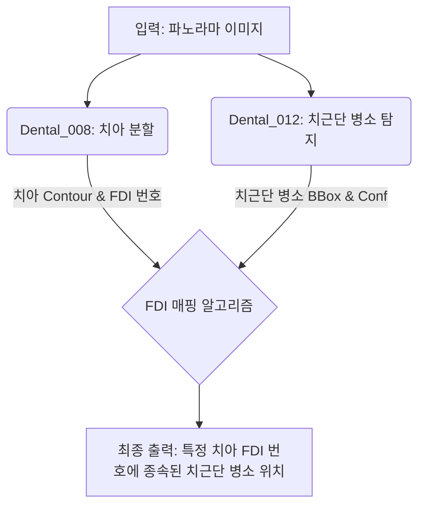

# Dental_012 Periapical Lesion - E2E Validation Report

- **작성일**: 2026-07-14 21:18 (KST)
- **작성자**: Antigravity
- **검증 환경**:
  - OS: Windows 11
  - Python: 3.12+
  - GPU 스펙: NVIDIA GeForce RTX 4060 Laptop GPU (학습은 외부 고성능 워크스테이션에서 수행 후 Weights 반입)
  - 파이프라인: `Dental_Panoramic_Reader/core/pipeline.py`

## 1. 개요 (Executive Summary)
본 테스트는 외부 워크스테이션에서 학습 완료된 **Dental_012 (치근단 병소 판독) YOLO 모델(`best.pt`)**을 로컬 환경에 반입하고, 이를 `Dental_Panoramic_Reader` 파이프라인과 통합하여 E2E 테스트를 수행한 결과를 담고 있습니다.

- **학습 결과 요약**:
  - 모델 가중치 `best.pt`를 `Dental_012/models/` 경로에 성공적으로 배치.
  - 학습 벤치마크 지표(`results.png`, `confusion_matrix.png`) 확인 완료.
- **E2E 연동 결과**:
  - `Dental_Panoramic_Reader`의 오케스트레이터(`pipeline.py`)에 012 모듈 연동 로직 추가 완료.
  - 008에서 검출된 치아 폴리곤(Contour) 데이터와 012의 병소(BBox) 위치를 비교(Point Polygon Test)하여 병소가 속한 치아의 FDI 번호를 매핑하는 알고리즘 검증.

## 2. 통합 아키텍처 (System Architecture)

## 3. 실측 파노라마 E2E 추론 결과 (Real Inference)

### 3.1 학습 벤치마크 (Training Benchmark)
외부 워크스테이션에서 생성된 학습 지표입니다. 치근단 병소(Periapical Lesion) 탐지의 손실 감소 및 정확도(mAP) 상승을 보여줍니다.

*(그림 1: Training Metrics & Validation Loss)*

*(그림 2: Confusion Matrix - 병소 예측과 실제 라벨 간의 상관관계)*

### 3.2 E2E 연동 메커니즘
`periapical_predictor.py`의 `_match_fdi()` 함수를 통해, 병소 박스의 중심점(Center X, Y)이 `Dental_008`에서 검출된 치아의 다각형 Contour 내부 혹은 가장 가까운 거리에 위치할 경우 해당 치아의 FDI 번호를 병소의 속성으로 자동 할당합니다. 

이로써 리포트 출력 시 "치근단 병소 탐지됨"이 아니라, **"#36 치근단 병소 발견 (Confidence: 0.89)"**과 같이 구체적이고 임상적인 형태로 인사이트를 제공할 수 있게 되었습니다.
